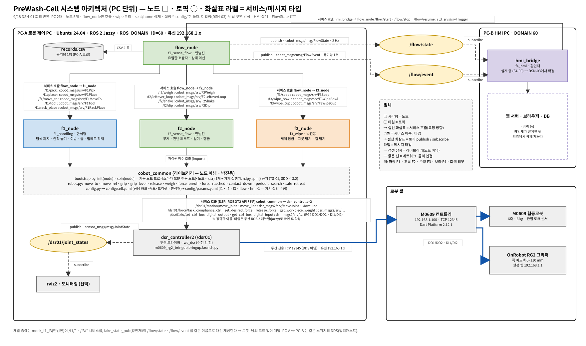
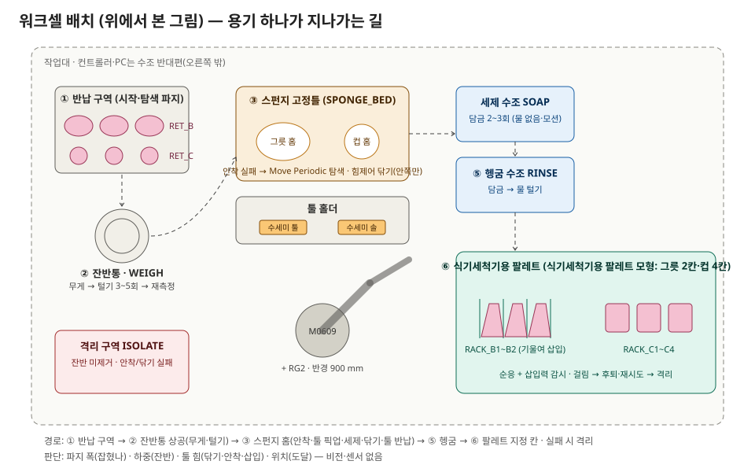
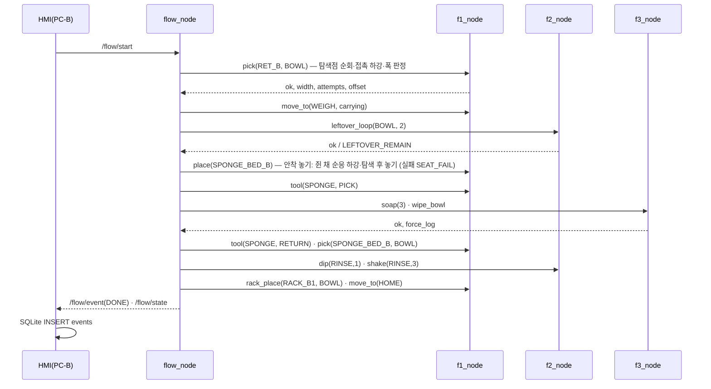
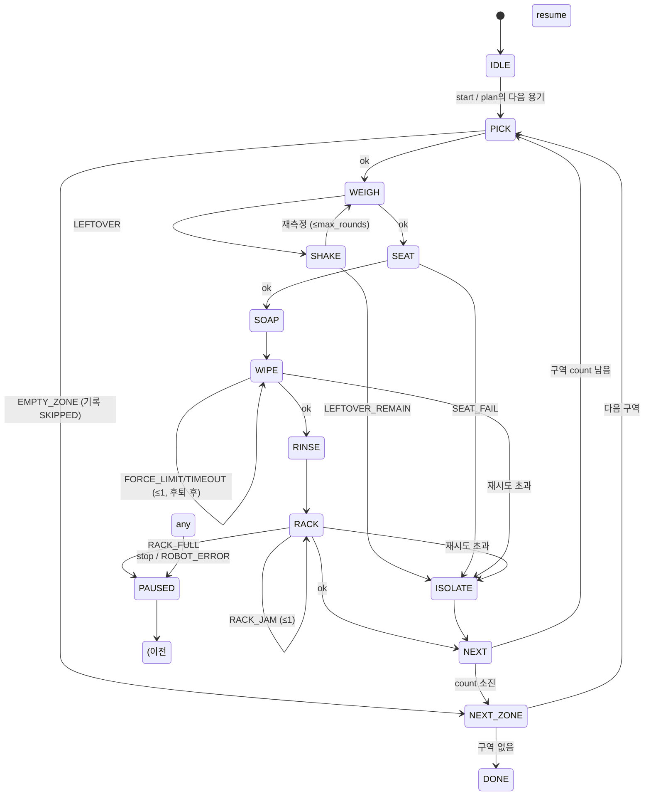

# 시스템 설계 문서 (SDD)
## PreWash-Cell — 다회용기 예비세척·식기세척기 팔레트 적재 자동화 셀

| 항목 | 내용 |
|---|---|
| 문서 ID | SDD-PREWASH-001 · v2.0 (2026-09-18) |
| 상위 | [01_요구사항_BR-SR.md](01_요구사항_BR-SR.md) · [02_인터페이스_IRD.md](02_인터페이스_IRD.md) · 일정표(구글 드라이브 xlsx) |
| 그림 | [images/system_architecture_pc.svg](images/system_architecture_pc.svg) (편집용 [.drawio](images/system_architecture_pc.drawio)) · [images/system_design.svg](images/system_design.svg) · [images/workcell.svg](images/workcell.svg) |

이 문서는 요구사항을 "실제로 어떻게 만들 것인가"로 바꾼다. PC 배치, 노드·패키지, 통신, 워크셀 좌표, 상태 머신, 각 노드의 내부 절차, 오류 처리, 안전, 배포를 정한다. 강사 산출물(시스템 아키텍처·네트워크 구성도·동작 순서도·하드웨어 구성·인터페이스 정의서·노드 구조도·HMI 화면·예외/오류·위험요소/안전대책)은 §12 표에서 이 문서의 절로 연결한다.

---

## 1. 시스템 아키텍처 (PC 단위)



그림 규칙: **사각형 = 노드, 타원 = 토픽, 점선 상자 = 라이브러리(노드 아님)**. 실선 화살표는 서비스 호출(요청 방향)이고 라벨에 `서비스 이름 : 타입`을 적는다. 점선 화살표는 토픽 publish/subscribe이고 라벨에 메시지 타입을 적는다. **PC-B(웹) 안쪽은 비워 두었다** — 황인재의 HMI 설계 초안(F4-00) 뒤 DSN-03 회의에서 채운다. 팀이 회의하며 다시 그릴 수 있게 같은 내용의 [.drawio](images/system_architecture_pc.drawio)를 둔다(생성기 `tools/gen/gen_arch.py`).

### 1.1 PC 배치 (통합 실행: 2대 · 개발: 4대 각자)
| PC | 역할 | 실행하는 것 | 네트워크 |
|---|---|---|---|
| **PC-A 로봇 제어 PC** (필수) | 두산 드라이버 + 동작 노드 전부 | `ws_dsr`: `m0609_rg2_bringup bringup.launch.py mode:=real host:=192.168.1.100 port:=12345` → `dsr_controller2`(/dsr01) · `rokey_pjt01_ws`: `f1_node` `f2_node` `f3_node` `flow_node` + `cobot_common` · `records.csv` | 컨트롤러와 같은 유선망 192.168.1.x, `ROS_DOMAIN_ID=60` |
| **PC-B HMI PC** (권장) | 시스템 모니터 | `rokey_pjt01_ws`: `cobot_msgs` + `f4_hmi/hmi_bridge`(FastAPI + rclpy, :8000) · `prewash.db`(SQLite) · 브라우저 | PC-A와 같은 스위치, `ROS_DOMAIN_ID=60` (DDS) |
| 개발 PC 4대 | 각자 독립 개발 | 한석형: `sodvir` + f1 + rig_f1 / 민범진: `sodvir` + f2 + flow + mock_f1_f3 / 박진용: `sodvir` + f3 + rig_f3 / 황인재: fake_state_pub + hmi_bridge + 브라우저(드라이버 불필요) | 각자 Virtual(127.0.0.1) |

동작 노드를 전부 PC-A에 두는 이유: 서비스 호출이 네트워크를 타면 지연·끊김이 로봇 동작 실패로 이어진다. HMI만 분리하면 화면을 따로 보여줄 수 있고 네트워크 구성도가 실제 내용이 된다. PC 2대 통신(V-09)이 안 되면 PC-A 1대에서 전부 실행한다(기술적으로 동일).

### 1.2 네트워크 구성도
```
[M0609 컨트롤러 192.168.1.100 :12345] ──유선── [스위치 192.168.1.0/24] ──유선── [PC-A 192.168.1.__]
                                                        │                        (DDS, DOMAIN 60)
[RG2 Compute Box 192.168.1.1 (설정 웹)]                 └────────유선────────── [PC-B 192.168.1.__] ── 브라우저/태블릿 (:8000)
```
PC-A ↔ 컨트롤러는 두산 전용 TCP(DDS 아님). PC-A ↔ PC-B는 ROS 2 DDS(멀티캐스트). 안 되면 FastDDS Discovery Server(강의 자료)로 전환.

### 1.3 통신 정의 (토픽·서비스·네트워크)
| 이름 | 타입 | 방향 | 구간 |
|---|---|---|---|
| `/flow/state` | `cobot_msgs/msg/FlowState` (2 Hz) | flow_node → hmi_bridge | PC-A → PC-B (DDS) |
| `/flow/event` | `cobot_msgs/msg/FlowEvent` | flow_node → hmi_bridge | PC-A → PC-B (DDS) |
| `/flow/start` `/flow/stop` `/flow/resume` | `std_srvs/srv/Trigger` | hmi_bridge → flow_node | PC-B → PC-A (DDS) |
| `/f1/pick` `/f1/place`(안착 놓기 포함) `/f1/move_to` `/f1/tool` `/f1/rack_place` | `cobot_msgs/srv/F1Pick` `F1Place` `F1MoveTo` `F1Tool` `F1RackPlace` | flow_node → f1_node | PC-A 내부 |
| `/f2/weigh` `/f2/leftover_loop` `/f2/shake` `/f2/dip` | `cobot_msgs/srv/F2Weigh` `F2LeftoverLoop` `F2Shake` `F2Dip` | flow_node → f2_node | PC-A 내부 |
| `/f3/soap` `/f3/wipe_bowl` `/f3/wipe_cup` | `cobot_msgs/srv/F3Soap` `F3WipeBowl` `F3WipeCup` | flow_node → f3_node | PC-A 내부 |
| `/dsr01/motion/move_joint` · `move_line` | `dsr_msgs2/srv/MoveJoint` · `MoveLine` | cobot_common(DSR_ROBOT2) → dsr_controller2 | PC-A 내부 |
| `/dsr01/force/task_compliance_ctrl` · `set_desired_force` · `release_force` · `get_workpiece_weight` | `dsr_msgs2/srv/…` | cobot_common → dsr_controller2 | PC-A 내부 |
| `/dsr01/io/set_ctrl_box_digital_output` · `get_ctrl_box_digital_input` | `dsr_msgs2/srv/…` (RG2 DO1/DO2 · DI1/DI2) | cobot_common → dsr_controller2 | PC-A 내부 |
| `/dsr01/joint_states` | `sensor_msgs/msg/JointState` | dsr_controller2 → 모니터링 | PC-A |
| dsr_controller2 ↔ 컨트롤러 | 두산 전용 TCP, 포트 12345 | | PC-A ↔ 컨트롤러 |
| 브라우저 ↔ hmi_bridge | HTTP `GET /` · `POST /api/start|stop|resume` · `GET /api/state` · `GET /api/history` · WS `/ws/state` (JSON) | | PC-B 내부 또는 LAN |
| hmi_bridge → prewash.db | SQLite `events`(FlowEvent 필드 그대로) · `state_log` | | PC-B 내부 |

`/dsr01/*` 서비스의 정확한 이름·필드는 [두산 ROS 2 매뉴얼(jazzy)](https://doosanrobotics.github.io/doosan-robotics-ros-manual/jazzy/services/motion_services.html)로 확인 후 확정한다. 우리 코드는 `cobot_common`을 통해서만 부르므로 이름이 달라도 한 곳만 고친다.

### 1.4 서브시스템 (패키지 7 · 노드 5)
| 패키지 | 노드 | 담당 | 소유 설정 | PC |
|---|---|---|---|---|
| `f1_handling` | `f1_node` | 한석형 | `config/cell.yaml`과 `config/params.yaml`의 `f1` 절 | A |
| `cobot_common` | (라이브러리) 두산 API를 감싼 공용 로봇 함수 모음 + **설정 로더·`config/cell.yaml`·`params.yaml`** | **박진용**(함수 전체·로더) · 좌표 값(`cell.yaml`)은 한석형 | 두 파일 | A·B |
| `f2_sense_flow` | `f2_node`, `flow_node` | 민범진 | `f2`·`flow` 절 | A |
| `cobot_msgs` | (srv 12 · msg 2, IRD 정본) | **황인재(PM)** — `docs/interfaces/`를 그대로 복사해 관리 | IRD | A·B |
| `f3_wipe` | `f3_node` | 박진용 | `f3` 절 | A |
| `f4_hmi` | `hmi_bridge` (+ `fake_state_pub` 개발용) | 황인재 | `hmi` 절 | B |
| `prewash_bringup` | (launch) `prewash.launch.py` · `prewash_mock.launch.py` | 황인재(PM) | — | A |

### 1.5 설계 결정
| 결정 | 이유 |
|---|---|
| 흐름 제어를 flow_node 하나로 집중 | 노드 간 호출이 얽히면 통합이 불가. 기능 노드는 서비스 제공자로만 |
| 기능 단위 노드 분할 | 4명 동시 개발. 각 기능이 단독 리그에서 시험 가능 |
| 서비스(동기) 사용, 액션 미사용 | 각 동작이 짧고(≤30 s) 취소 요구가 없음. 정지는 flow가 다음 호출을 안 하는 방식 |
| 종류 = 반납 구역, 위치는 탐색 | 비전 없이 종류 판별을 없애고, 위치·겹침은 **접촉 하강 + 파지 폭**으로 흡수 |
| 물리 인계 위치 고정 | F1이 놓은 자리에서 F3 시작 → 단독 시험은 손으로 놓기만 하면 됨 |
| 힘제어는 "힘 유지", 깊이 미사용 | 스펀지가 눌리므로 깊이 기준이 흔들림 |
| 안착 실패 탐색 = Move Periodic | 비전 없이 홈을 찾는 수단. 진폭·시간 한도로 안전 |
| Virtual + mock 2단 검증 | Virtual엔 힘·무게가 없어 mock이 흐름·HMI를, 실기가 임계값을 담당 |
| HMI = FastAPI 웹 + SQLite | 브라우저 어디서나, PC-B 분리 가능. SQLite는 파이썬 내장이라 설치 없음. MQTT는 ROS 토픽과 중복이라 안 씀 |
| PC 2대 | 로봇 동작은 한 PC, 모니터만 분리. 실패 시 1대로 축소 |

---

## 2. 하드웨어·워크셀



| 스테이션 | 위치(확정 시 기입) | 좌표계 | 비고 |
|---|---|---|---|
| `RET_B` / `RET_C` 반납 구역 | 로봇 좌측 전방, 각 200×200 mm급 | UC1 `RETURN` | 기준점 1 + 탐색점 오프셋. 용기가 겹치거나 어긋나 있어도 됨 |
| `WEIGH` | 잔반통 상공 고정 자세 | base | 측정 자세 1개 |
| `WASTE` | 잔반통 | base | 털기 진폭 반경 확보 |
| `SPONGE_BED_B` / `_C` | 스펀지 고정틀 홈 | UC2 `BED` | 작업대 고정. 닦기 후 재파지 위치(고정) |
| `TOOL_SPONGE` / `TOOL_BRUSH` | 툴 홀더 | UC2 | 손잡이 방향 고정 |
| `SOAP` / `RINSE` | 수조 2개(빈) | UC3 `TUB` | 컨트롤러 반대편 |
| `RACK_B1..2` / `RACK_C1..4` | 식기세척기용 팔레트 모형 | UC4 `RACK` | 기준점 1 + 오프셋(Pallet), 칸별 각도 |
| `ISOLATE` | 격리 구역 | base | 2개 이상 |
| `HOME` | 안전 자세 | joint | 모든 이동의 시작·끝 |

하드웨어 구성: M0609 + 컨트롤러 + RG2(Compute Box) + PC-A·PC-B + 스위치 + 워크셀 기구(반납 구역 트레이, 잔반통, 스펀지 고정틀, 툴 홀더 2, 수조 2, 팔레트 모형, 격리 구역). 용기 그릇 2·컵 2, 잔반 대용품(구슬·쌀).

---

## 3. 소프트웨어 구조
```
rokey_pjt01_ws/                ← 저장소 루트 (rokey_9_pjt1_D2)
├── docs/                      문서·인터페이스 정본·이미지
├── src/
│   ├── cobot_msgs/            srv·msg (IRD 정본)
│   ├── cobot_common/          robot.py (move/grip/force/weigh 공용 함수) · config.py (로더) · config/cell.yaml (공용) · config/params.yaml (기능별 절)
│   ├── f1_handling/           f1_node.py · test/rig_f1.py
│   ├── f2_sense_flow/         f2_node.py · flow_node.py · mock/mock_f1_f3.py · logger.py
│   ├── f3_wipe/               f3_node.py · test/rig_f3.py
│   ├── f4_hmi/                app.py (FastAPI) · static/index.html · fake_state_pub.py · db.py (SQLite)
│   └── prewash_bringup/        launch/prewash.launch.py · prewash_mock.launch.py
└── build/ install/ log/       (.gitignore)
```
두산 드라이버는 별도 워크스페이스 `~/ws_cobot_pjt/ws_dsr`(강사 배포, 수정 안 함)에 있고, 우리 워크스페이스(clone 위치 자유, `.bashrc`의 `PREWASH_WS`)가 그 위에 겹쳐진다(source 순서: ws_dsr → rokey_pjt01_ws). 상세는 [setup/M0609_환경설정.md](setup/M0609_환경설정.md).

### 3.1 `cobot_common` 공용 로봇 함수 (담당 박진용 — 9/18 F1 부담 분산. 좌표 값은 한석형의 `cell.yaml`)
| 함수 | 내용 |
|---|---|
| `move_to(station, carrying)` | 안전 높이 경유 movej/movel, carrying이면 속도 상한 |
| `move_rel(dx, dy, dz, frame)` | 기준점 대비 상대 이동(탐색점 이동용) |
| `grip(width, force) → width` | RG2 파지(목표 폭·힘) + 완료 대기 + 폭 피드백. 강사 배포 `onrobot_rg_control`(Modbus)은 힘(0~40 N)·폭을 명령마다 지정할 수 있고 현재 폭·파지 감지 비트를 돌려준다 |
| `grip_level(kind, level)` | 파지 힘 2단계 전환: `NORMAL`(집기·이송) ↔ `HOLD`(털기·담금·물 털기, 더 꽉). 같은 폭 목표로 힘만 바꿔 다시 파지, 전환 후 폭 재확인 |
| `release()` | |
| `weigh(n) → g` | reset → 정지 → get_workpiece_weight n회 평균 |
| `force_on(axis, target, limit)` / `force_off()` | task_compliance_ctrl + set_desired_force |
| `contact_down(max_depth, limit) → depth, force` | amovel 하강 + check_force_condition + stop (탐색 파지·안착·삽입 공용) |
| `periodic_search(amp, period, duration)` | Move Periodic |
| `safe_retreat()` | 툴 Z 후퇴 → 안전 높이 |

---

## 4. 데이터 흐름

### 4.1 동작 순서도 (그릇 1개)


### 4.2 데이터 사전
- 서비스·메시지: IRD §3~7 (정본 `docs/interfaces/`)
- `records.csv`(PC-A) 열: `ts, kind, zone_id, attempts, rack_slot, weight_before_g, weight_after_g, leftover_rounds, seat_offset_mm, wipe_duration_s, force_log_path, result, code, duration_s`
- `prewash.db`(PC-B, SQLite): 표 `events`(FlowEvent 필드 + `id`, `received_at`) · `state_log`(step, kind, zone_id, stamp, 1 Hz 샘플)
- 힘 로그 `force_YYYYMMDD_HHMMSS.csv`: `t, fx, fy, fz, target`

### 4.3 설정 파일 스키마 — `config/cell.yaml`(공용) + `config/params.yaml`(기능별 절)
설정 파일은 **2개**다(9/18 최종 결정). **`cell.yaml`**은 여러 노드가 같이 쓰는 값(좌표·속도·힘 상한·프리셋)을 한 곳에만 두고 한석형 혼자 고친다. **`params.yaml`**은 기능별 절(`f1 f2 f3 flow hmi`)을 한 파일에 모아 한눈에 보고, 각자 자기 절만 고친다(절이 떨어져 있어 git이 자동으로 합친다). 로더 `cobot_common/config.py`의 `load()`가 두 파일을 읽어 하나의 설정으로 합치므로 코드에서는 `cfg['cell']['beds']['SPONGE_BED_B']`, `cfg['f3']['wipe_bowl']`처럼 쓴다(경로는 패키지 share 상대경로, 환경변수 `PREWASH_CONFIG_DIR`로 대체 가능).
```yaml
# src/cobot_common/config/ — 파일 2개. cobot_common.config.load() 가 둘을 읽어 하나의 dict(cfg['cell'], cfg['f3'] …)로 합친다.
# ===== cell.yaml (공용 · 주인 한석형 혼자) =====
cell:                                   # 여러 노드가 같이 쓰는 값. 여기 한 곳에만 둔다
  limits: {vel_free_pct: 60, vel_carry_pct: 30, safe_z_mm: 150, contact_limit_n: 10, insert_limit_n: 15, timeout_s: 10}
  presets:                              # 종류·툴별 파지
    BOWL:   {grip_width_mm: 62.0, grip_force_n: 20, hold_force_n: 35, width_tol_mm: 3.0, approach_z_mm: 40}   # hold = 털기·헹굼용 강한 파지
    CUP:    {grip_width_mm: 70.0, grip_force_n: 15, hold_force_n: 30, width_tol_mm: 3.0, approach_z_mm: 40}   # 옆면 파지(9/18 V-17 확인)
    SPONGE: {grip_width_mm: 30.0, grip_force_n: 30, width_tol_mm: 2.0}
    BRUSH:  {grip_width_mm: 22.0, grip_force_n: 30, width_tol_mm: 2.0}
  stations: {HOME: {posj: [...]}, WEIGH: {posx: [...]}, WASTE: {...}, SOAP: {...}, RINSE: {...}, TOOL_SPONGE: {...}, TOOL_BRUSH: {...}, ISOLATE: {...}}
  zones:                                # 반납 구역(탐색 파지) — 방식은 DSN-03에서 확정
    RET_B: {frame: RETURN, origin_posx: [...], search: {offsets_mm: [[0,0],[40,0],[-40,0],[0,40],[0,-40]], max_attempts: 5, descend_max_mm: 80}}
    RET_C: {frame: RETURN, origin_posx: [...], search: {offsets_mm: [[0,0],[35,0],[-35,0],[0,35],[0,-35]], max_attempts: 5, descend_max_mm: 100}}
  beds:                                 # 스펀지 홈(안착 놓기·재파지 위치)
    SPONGE_BED_B: {frame: BED, origin_posx: [...], seat: {approach_z_mm: 30, contact_limit_n: 15, search_amp_mm: 3, search_period_s: 0.8, search_max_s: 6}}
    SPONGE_BED_C: {frame: BED, origin_posx: [...], seat: {approach_z_mm: 30, contact_limit_n: 15, search_amp_mm: 3, search_period_s: 0.8, search_max_s: 6}}
  rack: {origin_posx: [...], slots: {RACK_B1: {offset_mm: [..], tilt_deg: 30}, RACK_B2: {...}, RACK_C1: {...}, RACK_C2: {...}, RACK_C3: {...}, RACK_C4: {...}}}
# ===== params.yaml (기능별 절 · 자기 절만 수정) =====
f1: {insert_approach_mm: 30, tool_return_contact_n: 8}            # ── f1 절 (한석형) ──
f2:                                                                 # ── f2 절 (민범진) ──
  empty_weight_g: {BOWL: 180, CUP: 120}
  leftover_threshold_g: 50
  weigh_samples: 5
  shake: {WASTE: {amp_deg: 15, cycles: 4, period_s: 0.6}, RINSE: {amp_deg: 10, cycles: 3, period_s: 0.5}}
  dip: {RINSE: {depth_mm: 60, hold_s: 1.0}}
f3:                                                                 # ── f3 절 (박진용) ──
  soap: {depth_mm: 40, hold_s: 0.5}
  wipe_bowl: {target_force_n: 4.0, limit_n: 10.0, radius_mm: [15, 35], turns: 4, duration_s: 15}
  wipe_cup:  {insert_depth_mm: 60, rot_deg: 180, cycles: 4, stroke_mm: 30, limit_n: 10.0}
flow:                                                               # ── flow 절 (민범진) ──
  plan: [{zone: RET_B, kind: BOWL, count: 2}, {zone: RET_C, kind: CUP, count: 2}]
  rack_order: {BOWL: [RACK_B1, RACK_B2], CUP: [RACK_C1, RACK_C2, RACK_C3, RACK_C4]}
  policy: {EMPTY_ZONE: next_zone, LEFTOVER_REMAIN: isolate, SEAT_FAIL: isolate,
           FORCE_LIMIT: retry:1->isolate, TIMEOUT: retry:1->isolate, RACK_JAM: retry:1->isolate, TOOL_FAIL: retry:1->isolate,
           RACK_FULL: pause, ROBOT_ERROR: pause}
  consumables: {sponge_max_uses: 20, soap_max_dips: 60}
hmi: {port: 8000, state_rate_hz: 2, disconnect_after_s: 2.0, db_path: prewash.db}   # ── hmi 절 (황인재) ──
```
좌표·힘·횟수는 전부 여기에 둔다. 코드에 숫자를 쓰지 않는다. 경로는 항상 패키지 기준 상대경로.

**YAML 소유·키 이름 규칙 (🟡 PM 제안 — 9/19 DSN-03에서 확정)**
| 규칙 | 내용 | 예 |
|---|---|---|
| 소유 | `cell.yaml`은 **한석형 혼자**. `params.yaml`은 **절마다** 주인 1명(IRD §9): `f1` 한석형 · `f2`·`flow` 민범진 · `f3` 박진용 · `hmi` 황인재 | 남의 절 값이 필요하면 주인에게 요청 |
| 위치 | `src/cobot_common/config/cell.yaml` + `params.yaml`. 최상위 키 = `cell`(파일 1) / `f1 f2 f3 flow hmi`(파일 2의 절) | `cobot_common.config.load()['f3']['wipe_bowl']` |
| 키 이름 | 영문 소문자 `snake_case`, 약어 금지 | `grip_width`, `max_attempts` |
| 단위 접미사 | 숫자 키는 단위를 이름에 붙인다: `_mm` `_deg` `_n`(힘) `_g` `_s` `_hz` `_pct`(속도 %) | `descend_max_mm`, `contact_limit_n`, `period_s` |
| ID 값 | 종류·구역·칸·스테이션·코드는 IRD §2 **대문자 문자열 그대로** 키나 값으로 쓴다 | `zones: {RET_B: …}`, `policy: {SEAT_FAIL: isolate}` |
| 공용이냐 전용이냐 | 두 노드 이상이 읽으면 `cell.yaml`(복사 금지, 한 곳에만), 한 노드만 읽으면 `params.yaml`의 자기 절 | 속도 상한·프리셋·좌표 → `cell` / 나선 반지름 → `f3` |
| 좌표 | `posj`(관절 6개, deg) 또는 `posx`(x y z rx ry rz, mm·deg) 중 하나를 키 이름으로 명시 | `HOME: {posj: [...]}` |
| 기본값·범위 | 값 옆 주석에 단위·허용 범위·바꾼 이유(날짜) | `target_force_n: 4.0   # 3~5, 9/19 V-03 결과` |
| 변경 공유 | **키 이름** 추가·변경은 팀 공유(채널), **값** 변경은 주인 재량 + 커밋 본문에 이유 | `fix(f3): wipe 상한 10→8 N (스펀지 밀림)` |

---

## 5. 상세 설계

### 5.1 flow_node 상태 머신 (민범진)

- 각 전이에서 `/flow/state` 발행(2 Hz 타이머 + 전이 즉시), 용기 종료 시 `/flow/event` + CSV 1행.
- `stop`은 현재 서비스 완료 후 다음 호출을 보류. 하드웨어 비상정지는 로봇 E-Stop.
- 어떤 실패에서도 **툴은 홀더에 반납**(flow가 `tool(RETURN)` 호출), 로봇은 안전 높이.

### 5.2 f1_node (한석형)
**pick (탐색 파지)** — 겹치거나 어긋난 용기를 비전 없이 집는 절차:
```
for i, (dx,dy) in enumerate(zone.search.offsets_mm):        # 탐색점 순서
    move_to(zone 상공 + (dx,dy), carrying=False)             # 안전 높이
    release(); 그리퍼 열기(프리셋 폭 + 여유)
    depth, f = contact_down(descend_max_mm, contact_limit_n) # 접촉(용기 테두리/바닥) 또는 최대 깊이에서 정지
    → 겹친 용기는 위 용기 높이에서 멈춘다 (높이 적응)
    w = grip(preset.grip_width, preset.grip_force)           # 파지
    if |w - preset.grip_width| <= width_tol:  성공 → 상승 → return ok, w, i+1, (dx,dy)
    else: release(); safe_retreat()                          # 헛잡음(≤5 mm)·두 개 파지(폭 초과) → 다음 점
return EMPTY_ZONE (attempts = max_attempts)
```
- 탐색점은 구역 기준점 대비 오프셋 목록(`config/cell.yaml`의 `zones`). 처음엔 중심, 그다음 십자·대각 순.
- 폭 판정: `≤ 5 mm` 빈손, `> width + tol` 두 개 파지 또는 비스듬히 잡힘 → 둘 다 재탐색.
- 하강은 항상 힘 상한·최대 깊이·타임아웃과 함께(NFR-01).
- `zone_id`가 `SPONGE_BED_*`면 탐색점 1개(고정 위치 재파지).

**place (안착 놓기)** — `station`이 `SPONGE_BED_B/C`일 때: 용기를 쥔 채 홈 상공(`cell.beds.*.seat.approach_z_mm`) → `force_on(z)` 순응 하강 → `contact_down`으로 접촉·깊이 판정 → 깊이 미달이면 `periodic_search(amp, period, max_s)` 중 접촉 조건 감시 → 들어가면 `release` → 후퇴(`OK`, `offset_mm`) / 한도 초과면 들고 후퇴(`SEAT_FAIL`). 그 외 station은 상공 → 하강 → 놓기 → 후퇴. (구 `/f3/seat`의 동작을 흡수)

**rack_place**: 팔레트 기준점 + 칸 오프셋 → 지정 각도(tilt) → 상공 → `force_on(z)` 하강 → `contact_down`으로 삽입력 감시 → 도달 시 `release` → 후퇴. 걸림(힘 > limit, 깊이 미달) → 후퇴 → `RACK_JAM`.

**tool**: 홀더 방향 고정, 픽업 후 폭 확인(범위 밖 → `TOOL_FAIL`), 반납 시 홀더 상공 → 하강 → 힘 접촉으로 바닥 확인 → release.

좌표는 전부 `config/cell.yaml`. 티칭: Dart Platform으로 자세 → 좌표 읽기 → YAML → ROS 재현 → 🚨 제어권 해제.

### 5.3 f2_node (민범진)
- `weigh`: `move_to(WEIGH)` → 0.5 s 정지 → `weigh(n)`. 툴 무게 사전 설정(빈 그리퍼).
- `leftover_loop`: `weigh` → 판정(임계 50 g, 미만은 OK) → `move_to(WASTE)` → `shake(WASTE)` → `weigh` … 최대 `max_rounds`.
- **강한 파지**: `shake`·`dip`(과 이를 부르는 `leftover_loop`)는 시작할 때 `grip_level(kind,'HOLD')`, 끝날 때 `grip_level(kind,'NORMAL')`. 동작 전후 폭을 비교해 변했으면(미끄러짐) `GRIP_FAIL`.
- `shake`: J5/J6 관절 왕복(Move Periodic 또는 movej 왕복). 충돌 감지 오작동 시 진폭 축소(V-07).
- `dip`: 수조 상공 → `depth_mm` 하강 → `hold_s` → 상승.

### 5.4 f3_node (박진용)
- `soap`: 툴 든 채 SOAP 수조 담금 `count`회.
- `wipe_bowl` (`/f3/wipe_bowl`): 홈 중심 상공 → `force_on(z, target_force, limit)` → r1→r2 나선 `turns`회 → `force_off` → 후퇴. 힘 로그 저장.
- `wipe_cup` (`/f3/wipe_cup`): 컵 중심 상공 → 삽입 깊이까지 하강(힘 감시) → J6 ±rot_deg 회전 + Z 스트로크 `cycles` → 후퇴.

### 5.5 hmi_bridge (황인재) — 시스템 모니터
- 구조: FastAPI(uvicorn) + rclpy 스레드. rclpy는 별도 스레드에서 `spin`, 서비스 호출은 요청 스레드를 막지 않게 실행. WebSocket이 `/flow/state`·`/flow/event`를 브라우저에 밀어준다.
- SQLite(`db.py`): `/flow/event` 수신마다 `events` INSERT, 1 Hz로 `state_log` INSERT. `GET /api/history`가 최근 N건 반환.
- 화면 구성(강의 HMI 요소 반영):
  | 영역 | 내용 |
  |---|---|
  | 제어 | 시작 · 정지(소프트 E-STOP, 항상 보임, 붉은색) · 재개. 활성 조건은 §6 |
  | 상태 | 모드/단계(step), 현재 용기·구역, 진행률(done/target), 사이클 타임 |
  | 구역·팔레트 | 반납 구역 2칸(대기/처리중/완료), 팔레트 칸 6개(비어 있음/적재) |
  | 수량·소모품 | 그릇·컵 성공/격리, 수세미 사용·세제/헹굼 담금 바(임계 도달 시 색) |
  | 통신 | ROS 연결 점(초록/빨강, `/flow/state` 2 s 이상 없으면 빨강), 마지막 수신 시각 |
  | 오류·알람 | 마지막 코드 + 메시지, 오류 로그 목록(붉은 경고 우선) |
  | 이력 | 최근 이벤트 표(SQLite), 무게 전/후, 시도 횟수, 결과 |
- `fake_state_pub.py`: 시나리오(yaml)대로 정상·격리·오류·PAUSED를 발행 → 로봇·팀원 코드 없이 개발.

---

## 6. 휴먼 인터페이스
| 요소 | 동작 |
|---|---|
| 시작 | IDLE에서만 활성. plan 순서대로 처리 |
| 정지(소프트 E-STOP) | 현재 서비스 완료 후 PAUSED. 항상 표시 |
| 재개 | PAUSED에서 이전 상태로 |
| 격리 알림 | 격리 구역이 차면 경고, 비움 확인 버튼 |
| 팔레트 만재 | RACK_FULL → 교체 후 확인 버튼(resume) |
| 소모품 | 임계 도달 시 경고 |
| 연결 | 끊김 시 버튼 비활성 + 빨간 표시 |

## 7. 예외·오류 처리
| 코드 | 발생 | 처리 | 표시 |
|---|---|---|---|
| `EMPTY_ZONE` | 탐색 최대 횟수까지 파지 실패 | 구역 종료, 다음 구역 (SKIPPED 기록) | 정보 |
| `LEFTOVER_REMAIN` | 털기 후에도 임계 초과 | 격리 | 경고 |
| `SEAT_FAIL` | 탐색 한도 초과 | 격리 | 경고 |
| `TOOL_FAIL` | 툴 폭 범위 밖(툴 없음) | 재시도 1회 → 격리 | 경고 |
| `FORCE_LIMIT` / `TIMEOUT` | 닦기·삽입·하강 | 즉시 후퇴 → 재시도 1회 → 격리 | 경고 |
| `RACK_JAM` | 삽입 걸림 | 후퇴 → 재시도 1회 → 격리 | 경고 |
| `RACK_FULL` | 칸 소진 | PAUSED + 알림 | 오류 |
| `ROBOT_ERROR` | dsr 오류·충돌 정지 | PAUSED, 운영자 확인 후 resume | 오류 |
| 통신 끊김 | `/flow/state` 2 s 이상 없음 | HMI 버튼 비활성, 빨간 표시 | 오류 |
공통: 어떤 실패에서도 툴은 홀더에 반납, 로봇은 안전 높이. GRIP_FAIL은 f1 내부 재탐색으로 소화.

## 8. 위험요소·안전대책
| 위험(강의 "협동로봇 운용 시 주의사항" + 우리 셀) | 대책 |
|---|---|
| J3–J4, J1·J2–J5·J6 사이 신체 끼임 | 작업 반경 안에 사람 없음, 첫 실기 속도 20~30%, E-Stop에 손 닿는 사람 1명 상시 |
| 툴(수세미 툴·솔) 날카로운 부분, 볼트 풀림 | 툴 손잡이 모서리 처리, 매 실기 전 그리퍼·툴 볼트 확인 |
| 잘못된 그립·전원 차단으로 물체 낙하 | 파지 폭 판정, 들고 있을 때 저속, 낙하 구역에 사람 없음 |
| 접촉 동작 중 과도한 힘 | 힘 상한 + 후퇴 + 타임아웃(코드 리뷰에서 강제), 순응은 접촉 구간만 |
| 털기·물 털기 진폭 | 진폭·속도 YAML 상한, 충돌 감지 유지 |
| 비상정지 버튼 혼동 | 로봇 E-Stop 위치를 브리핑에서 매일 확인, HMI 정지는 소프트 정지임을 명시 |
| 안전 매개변수 무단 변경 | 안전 암호는 강사 관리, 충돌 감도·속도 한계 변경은 박진용(안전 담당) 승인 |
| 티치펜던트·ROS 동시 제어 | 티칭 후 제어권 해제 확인 후 브링업 |
| 액체 | 수조에 물 없음(모션만), 잔반 대용품은 고형물 |

## 9. 테스트·검증 계획
원칙: **구현 → 사전 검증(V) → L1 단위기능 테스트(녹화) → L2 단위기능 통합 → L3 노드 통합 → L4 전체 통합**. 이전 단계 통과 없이 다음 단계 금지. 날짜·담당·로봇 슬롯은 일정표(구글 드라이브 xlsx, §13)에서 관리하고 여기서는 **무엇을 어떻게 통과시키는가**만 정한다.


### 9.1 단계와 책임
| 단계 | 내용 | 주도 | 로봇 | 시기 |
|---|---|---|---|---|
| **L1 단위기능 테스트** | 각 기능 노드를 단독 리그에서 서비스별 10회, **녹화** | 각 담당 | 실기(F1·F2·F3) / 없음(F4·flow) | 9/20 |
| **L2 단위기능 통합** | 시나리오 단계 = 기능 2개 조합, flow_node로 호출 | 조합별 주도 | 실기 | 9/20 저녁~9/22 오전 |
| **L3 노드 통합** | 그릇 1·컵 1 end-to-end + 실제 HMI(PC-B) | 민범진 | 실기 | 9/22 |
| **L4 전체 통합** | 4개 연속 + 실패 주입 4종 + 측정 + 영상 + 동결 | 민범진 | 실기 | 9/23 |

### 9.2 사전 검증 (V) — "우리 하드웨어로 되는가"를 TC 전에 확인
| ID | 검증 | 담당 | 언제 | 기준 | 안 되면 |
|---|---|---|---|---|---|
| V-01 | 파지 폭으로 그릇·컵·빈손 3상태 구분 | S | 9/18 C | 세 값 간격 ≥ 6 mm | 핑거 패드 두께·프리셋 폭 조정 |
| V-02 | 하중 측정 정밀도(100/200 g 추 10회) | M | 9/18 C | ±20 g | 임계 100 g, 대용품 무겁게 |
| V-03 | 힘제어 켠 채 XY 나선 이동 | P | **9/18 C** | 가능 | 닦기 = 순응 + 위치 2~3 mm 누르기 |
| V-04 | Move Periodic 탐색으로 홈 안착(2 mm 오프셋) | P | 9/19 B | 5회 중 4회 | 홈 여유 늘리기, 챔퍼 |
| V-05 | RG2 DO1/DO2 배선·DI1/DI2 완료 신호 | S | 9/18 C | 신호 왕복 | 폭 피드백만으로 판정 |
| V-06 | 팔레트 칸 삽입 각도·걸림 힘 판정 | S | 9/19 B | 걸림 시 힘 상승 식별 | 각도 삽입 → 수직 놓기 |
| V-07 | 털기 진폭·속도에서 충돌 감지 오작동 | M | 9/19 B | 10회 정지 0 | 진폭 축소, 관절 왕복 |
| V-08 | 툴 홀더 픽업·반납 10회 | S | 9/19 B | ≥9/10 | 홀더 깊이·방향 고정 보강 |
| V-09 | PC-A↔PC-B DDS 통신(DOMAIN 60) | H·M | 9/19 A | 토픽·서비스 왕복 | Discovery Server → 안 되면 PC 1대 |
| V-10 | 컵 안쪽 솔 삽입 깊이·충돌 | P | 9/19 B | 정지 0 | 스트로크 축소 |
| V-11 | 잔반 대용품 선정(구슬·쌀, ≥100 g, 털면 떨어짐) | 전원 | 9/18 | 확정 | — |
| V-12 | 스펀지 홈 치수 vs 용기 외경(여유 1~2 mm) | P | **9/19 A**(재료 도착 후) | 둘 다 들어감 | 재커팅 |
| V-13 | 브라우저 start → mock flow 반응 | H | 9/20 A | PAUSED/재개 반영 | 브리지 스레드 구조 수정 |
| V-14 | **겹친·어긋난 용기 탐색 파지** 성공률 | S | 9/20 A | ≥9/10, 낙하 0, 두 개 파지 0 | 탐색점 간격·하강 깊이·폭 허용치 조정 |
| V-15 | **재파지 파지 폭 인식** — 스펀지 홈에 안착된 그릇·컵을 다시 잡을 때 폭으로 정상·빈손·비스듬히 잡힘이 구분되는가 | S·P | 9/19 B | 3상태 간격 ≥ 6 mm | 재파지 위치에 가이드 추가, 또는 폭 대신 하중으로 확인 |
| V-16 | **강한 파지(HOLD) 값 찾기** — 그릇·컵을 `HOLD` 힘으로 쥐고 털기·물 털기를 할 때 낙하·밀림이 없는 최소 힘(용기가 찌그러지지 않는 범위) | S·M | 9/19 B | 10회 낙하 0, 전후 폭 변화 ≤ 2 mm | 핑거 패드, 진폭·속도 축소 |
| V-17 | **컵 옆면 파지** — ✅ **9/18 검증 완료**: 옆면 파지로 집기·이송 가능. 단, 털기·헹굼처럼 흔드는 동작에서는 더 강한 파지가 필요 → 파지 힘 2단계(`NORMAL`/`HOLD`) 도입 | S | 완료 | 집기·이송 안정 | — |
| V-18 | **툴 파지 안정성** — 닦는 힘(3~5 N)이 걸릴 때 수세미 툴·솔이 그리퍼 안에서 밀리거나 돌지 않는가 | P | 9/19 B | 닦기 1회 후 툴 자세 변화 없음 | 손잡이 형상(각·홈) 보강, 파지력 상향 |
| V-19 | **도달 범위·특이점** — 모든 스테이션(반납 구역·WEIGH·WASTE·스펀지 홈·홀더·수조·팔레트 6칸·격리)에 안전 높이 경유로 도달 가능한가 | S | 9/19 A(티칭과 함께) | 전 지점 도달, 특이점·관절 한계 경고 0 | 워크셀 재배치 |
| V-20 | **여러 노드의 두산 API 동시 사용** — f1·f2·f3 세 프로세스가 각각 DSR API를 초기화해 같은 드라이버에 순차 명령을 보낼 수 있는가(Virtual) | S·M | 9/18 C | 세 노드에서 번갈아 movej 성공 | 로봇 명령을 한 노드(robot 서버)로 모으고 나머지는 서비스로 요청 |
| V-21 | **서비스 콜백 안 장시간 모션** — 수 초~수십 초 걸리는 모션을 서비스 콜백에서 실행할 때 rclpy 실행기가 막히지 않는가(콜백 그룹·MultiThreadedExecutor) | M | 9/19 A(mock) | flow가 응답을 받고 `/flow/state` 2 Hz 유지 | 액션으로 전환 또는 모션 스레드 분리 |
| V-23 | **파지 힘 전환 방법** — 쥔 상태에서 힘만 올려 다시 파지(`grip_level`)가 되는가. `onrobot_rg_control`(Modbus)로 힘 지정이 되는지, DO1/DO2 방식이면 RG2 웹의 프리셋 2종으로 나눌지 | P·S | 9/19 A | 쥔 채 NORMAL→HOLD→NORMAL 전환 10회, 낙하 0 | 처음부터 HOLD 힘으로만 파지(힘 1단계) |
| V-22 | **티칭 좌표 재현 오차** — YAML 좌표를 ROS에서 재현했을 때 티칭 위치와의 차이 | S | 9/19 A | ≤ 2 mm | 사용자 좌표계·TCP 설정 재확인 |

### 9.3 L1 단위기능 테스트 케이스
| TC | 기능 | SR | 리그(손으로 준비) | 절차 | 통과 기준 | 담당 |
|---|---|---|---|---|---|---|
| TC-01 | F1 탐색 파지 | SR-01·02 | 반납 구역에 그릇 2개를 **겹쳐/어긋나게** 배치, 컵 2개 동일, 빈 구역 1회 | `pick(RET_B)` 10회, `pick(RET_C)` 10회, 빈 구역 5회 | 각 ≥9/10, 빈 구역 `EMPTY_ZONE` 5/5, 낙하 0, 두 개 파지 0 | 한석형 |
| TC-02 | F1 툴·이송 | SR-03 | 툴 홀더 2종 | `tool PICK/RETURN` 각 10회, `move_to` 전 스테이션 | ≥9/10, 안전 높이 준수 | 한석형 |
| TC-09 | F1 팔레트 적재 | SR-12·13 | 팔레트 모형, 그릇·컵 | `rack_place` 6칸 각 5회, 걸림 유도 2회 | ≥9/10, 낙하 0, 걸림 → `RACK_JAM` 후퇴 | 한석형 |
| TC-03 | F2 무게 | SR-04 | 100 g·200 g 추 | `weigh` 각 10회 | ±20 g | 민범진 |
| TC-04 | F2 잔반 폐루프 | SR-05·06 | 대용품 용기 4, 빈 용기 4 | `leftover_loop` | 검출 100%, 오판 0, 재측정 로그 | 민범진 |
| TC-08 | F2 헹굼·물털기 | SR-11 | 수조(빈) | `dip` + `shake(RINSE)` 10회 | 충돌 정지 0 | 민범진 |
| TC-05 | F1 안착 놓기 | SR-07 | 스펀지 홈, 용기를 그리퍼에 쥐여줌 | `place(SPONGE_BED_B/C)` 정위치 5 + 2 mm 오프셋 5 | ≥9/10, 한도 초과 → `SEAT_FAIL` | 한석형 |
| TC-06 | F3 그릇 닦기 | SR-08·10 | 홈에 그릇, 툴을 손으로 쥐여줌 | `soap(3)` → `wipe_bowl` 10회, 힘 로그 | 목표 ±2 N, 상한 초과 0, 강제 초과 시 후퇴 | 박진용 |
| TC-07 | F3 컵 닦기 | SR-09 | 홈에 컵, 솔 쥐여줌 | `wipe_cup` 10회 | 정상 10, 이탈 0 | 박진용 |
| TC-10 | flow 정책 | SR-14 | mock_f1_f3 + 실패 주입 | 코드 5종 주입 | 정책대로 재시도/격리/정지/재개, EMPTY_ZONE → 다음 구역 | 민범진 |
| TC-11 | HMI | SR-15 | fake_state_pub | 버튼 3종, 상태·연결·오류·이력 표시 | 서비스 호출 ≤1 s, 표시 지연 ≤1 s, 끊김 표시 | 황인재 |
| TC-12 | 기록 | SR-16 | mock 흐름 4개 | CSV·SQLite 확인 | 4행, 필드 누락 0 | 민범진·황인재 |

### 9.4 L2 단위기능 통합
| INT | 조합 | 시나리오 단계 | 절차 | 통과 기준 | 주도 |
|---|---|---|---|---|---|
| INT-12a | F1 + F2 | 탐색 파지 → 무게 → 털기 | `pick→move_to(WEIGH)→leftover_loop` 5회 | 5회 무개입, 판정 정확 | 민범진 |
| INT-13 | F1 + F3 | 안착 놓기 → 툴 → 세제 → 닦기 → 반납 | `place(안착)→tool→soap→wipe_bowl/wipe_cup→tool` 5회(그릇·컵) | 5회 무개입, 힘 로그 | 박진용 |
| INT-12b | F1 + F2 | 재파지 → 헹굼 → 물털기 → 적재 | `pick(BED)→dip→shake→rack_place` 5회 | 5회, 낙하 0 | 한석형 |
| INT-4 | flow + HMI | 시작·정지·재개 | mock에서 실제 HMI(PC-B) 연결 | 버튼 동작·상태 표시 | 황인재 |

### 9.5 L3 노드 통합
| INT | 내용 | 통과 기준 |
|---|---|---|
| INT-3a | 그릇 1개 end-to-end (실제 노드 3 + flow + HMI) | 무개입 3회 연속 |
| INT-3b | 컵 1개 end-to-end | 무개입 3회 연속 |

### 9.6 L4 전체 통합 (수락)
| INT | 내용 | 기준 |
|---|---|---|
| INT-4a | 시작 1회 → 그릇 2·컵 2 연속 | AC-1, AC-7 |
| INT-4b | 실패 주입: 빈 구역 / 잔반 과다 / 툴 미배치 / 팔레트 걸림 + 정지·재개 | AC-6 |
| INT-4c | 성공률·사이클 타임·잔반 검출률 측정 ×3 | AC-2~5 수치 |
| INT-4d | 시연 영상 원본 촬영 · `v1.0-demo` 태그 · 기능 동결 | 영상 확보 |

### 9.7 실패 주입 방법
| 주입 | 방법 |
|---|---|
| 빈 구역 | RET_C를 비워둠 → `EMPTY_ZONE` → 다음 구역/DONE |
| 잔반 과다 | 대용품 200 g → 털어도 남게 고정 → 격리 |
| 툴 미배치 | 수세미 툴을 홀더에서 빼둠 → `TOOL_FAIL` |
| 팔레트 걸림 | 칸에 방해물 → `RACK_JAM` → 후퇴·재시도 → 격리 |
| 정지·재개 | 실행 중 HMI 정지 → PAUSED → 재개 |

### 9.8 기록·녹화 규칙
- 시험 기록: `docs/test_logs/YYYYMMDD_TCxx.md` — 일시·담당·모드(Virtual/Real)·속도·결과표·로그 경로·영상 파일명·이슈 번호.
- **단위기능 테스트마다 녹화.** 영상 파일명 `YYYYMMDD_TCxx_기능_담당_시도N.mp4` (예: `20260920_TC01_pick_한석형_시도1.mp4`). 통합은 `YYYYMMDD_INTxx_…`. 영상은 저장소에 넣지 않고 드라이브·노션 링크를 기록에 적는다.
- 사전 검증(V)도 같은 양식으로 `YYYYMMDD_Vxx_…`.

### 9.9 범위 방어 (지연 시)
| 시점 | 조건 | 조치 |
|---|---|---|
| 9/18 저녁 | V-02 무게 정밀도 미달 | 잔반 임계 100 g, 대용품 무겁게 |
| 9/19 저녁 | V-03 힘제어 중 이동 불가 | 닦기를 "순응 + 위치 2~3 mm 누르기"로 |
| 9/19 저녁 | V-09 PC 통신 불가 | PC-A 1대로 통합 |
| 9/20 오전 | V-14 탐색 파지 미달 | 탐색점 축소(중심 + 십자 4), 용기 겹침 없이 어긋남만 시연 |
| 9/20 저녁 | UT-F1 적재 미통과 | 각도 삽입 → 수직 놓기 |
| 9/20 저녁 | UT-F3 컵 미통과 | 컵 닦기 도전 과제, 그릇만 MVP |
| 9/22 오전 | L2 하나라도 미통과 | L3를 9/23 오전으로, 4개 연속 → 2개(그릇1·컵1) |
| 9/23 이후 | 신규 기능 | 금지. 버그·파라미터만 |

## 10. 배포·실행
```bash
# PC-A
sod && sodreal                                     # 실기 브링업 (Virtual은 sodvir)
soc && ros2 launch prewash_bringup prewash.launch.py vel_scale:=0.3
# PC-B
soc && ros2 run f4_hmi hmi_bridge                  # http://<PC-B>:8000
# 로봇 없이 (한 PC)
soc && ros2 launch prewash_bringup prewash_mock.launch.py
```
런치 인자: `use_mock:=true|false`, `vel_scale:=0.3`. 첫 실기는 `vel_scale 0.2~0.3`.

## 11. 확인 중
| 항목 | 담당 | 기한 |
|---|---|---|
| `/dsr01/*` 서비스 정확한 이름·필드 | 한석형 | 9/19 |
| 탐색점 간격·최대 횟수(V-14) | 한석형 | 9/20 |
| **반납 구역 방식(구역+탐색 vs 고정 슬롯)** — DSN-03 | 전원 | 9/19 저녁 |
| **재파지 파지 폭 인식(V-15)** — 스펀지 홈의 용기를 다시 잡을 때 폭으로 판정 가능한가 | 한석형·박진용 | 9/19 오후 |
| **HMI 설계 초안(F4-00)** → `FlowState`·`FlowEvent` 필드 확정 | 황인재 | 9/19 오전 |
| **실패 코드·정책, YAML 키 규칙** 팀 확인 — DSN-03 | 전원 | 9/19 저녁 |
| 하중 측정 정밀도(V-02) | 민범진 | 9/18 |
| 힘제어 중 XY 이동(V-03) | 박진용 | 9/19 |
| PC 2대 통신(V-09) | 황인재·민범진 | 9/19 |
| 잔반 대용품(V-11) | 전원 | 9/18 |

## 12. 강사 요구 산출물 ↔ 이 문서
| 강사 산출물 | 위치 |
|---|---|
| 시스템 아키텍처 | §1 그림 + [images/system_architecture_pc.drawio](images/system_architecture_pc.drawio) |
| 네트워크 구성도 | §1.2 |
| 동작 순서도 | §4.1, §5.1 |
| 하드웨어 구성 | §2 |
| 토픽/서비스/액션 인터페이스 정의서 | §1.3 + [02_인터페이스_IRD.md](02_인터페이스_IRD.md) |
| ROS 2 노드 구조도 | §1.4, §3 |
| HMI 화면 구성 | §5.5, §6 |
| 예외/오류 리스트 및 처리 | §7 |
| 위험요소·안전대책 | §8 |
| Business Requirements | [01_요구사항_BR-SR.md](01_요구사항_BR-SR.md) |

## 13. 일정표 (정본: 구글 드라이브)
일정표 `prewash_개발일정_v2.xlsx`는 **구글 공유 드라이브**에서 팀이 함께 관리한다([일정표(구글 시트)](https://docs.google.com/spreadsheets/d/1zV0yb2k89li7SNBvDWSXT2jT3KTbuDVF/edit?usp=sharing)). 시트: Time Line(팀별 색 간트) · 상세(산출물·완료기준) · 마일스톤·로봇 슬롯(강사 일정·마감·로봇 슬롯·제출 규칙) · 완료 목록 · 규칙 · 변경이력. 갱신은 PM(황인재)만(진행·상태·변경이력). 저장소에는 사본을 두지 않는다.
