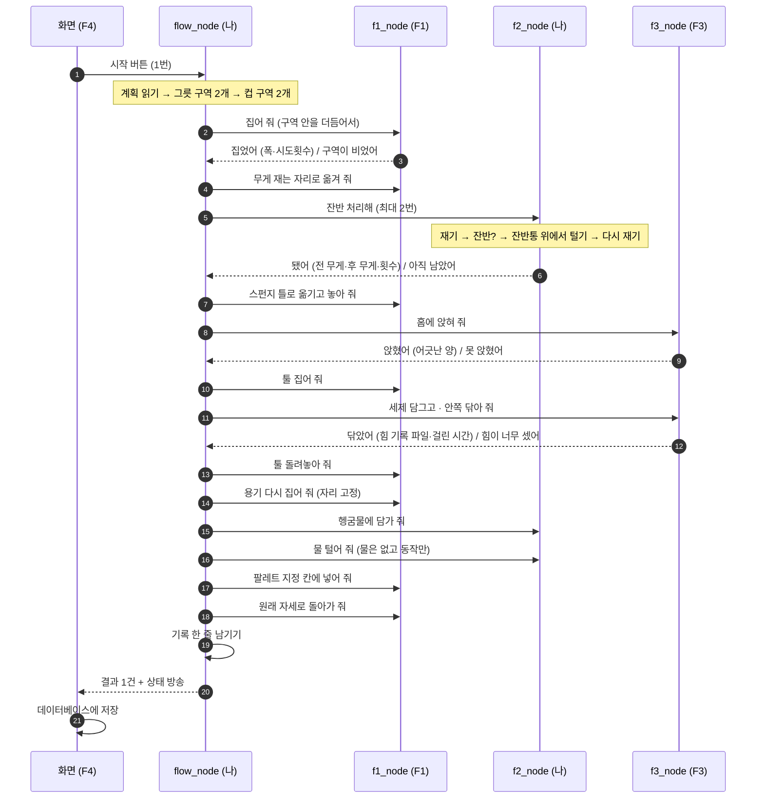

# F2 전체 정리 — 무게 재기 · 털기 · 헹굼 + 흐름 지휘 + 공용 메시지

> 담당: **민범진** (F2) · 작성 2026-09-18 · **쉬운 말 버전**
> 이 문서는 **기준 문서가 아니다.** 기준(= 팀이 합의한 원본)은 [01_요구사항_BR-SR.md](../01_요구사항_BR-SR.md) · [02_인터페이스_IRD.md](../02_인터페이스_IRD.md) · [03_설계_SDD.md](../03_설계_SDD.md) · 구글 드라이브 일정표다.
> 이 문서는 그 세 곳에 흩어져 있는 **F2 몫만 골라, 실제 작업 순서대로 모아 놓은 지도**다. 숫자가 서로 다르면 원본이 맞다.

### 이 문서 읽는 순서

| 상황 | 이렇게 읽는다 |
|---|---|
| 처음 본다 | §1(내가 맡은 것) → §2(말 뜻) → §3(전체 흐름) 까지만. 여기까지가 전체 그림 |
| 이제 만들려고 한다 | §4(내 서비스 4개) → §5(흐름 지휘) → §8(설정값) |
| 시험·발표 준비 | §11(시험) → §12(일정) → §16(아직 안 정해진 것) |
| 모르는 말이 나왔다 | §15로 점프 (말 뜻만 모아 둔 곳) |

> 📌 **표기 약속**: 어려운 말은 처음 나올 때 `쉬운 말(어려운 말)` 로 적는다. 예: `기준선(임계)`.
> 👉 표시가 붙은 줄은 **비유로 다시 설명한 것**이다. 이해됐으면 건너뛰어도 된다.

> 🚨 **이 판은 IRD v2.0 기준이다 (2026-09-18 21시 기준 미갱신).**
> `main`에 **인터페이스 v2.1 + 1차 설계회의(DSN-01)** 가 들어오면서 아래가 달라졌다. **다음 갱신에서 반영한다.**
>
> | 바뀐 것 | 이 문서에서 고칠 곳 |
> |---|---|
> | 이름이 **PreWash-Cell** 로 변경 | 전체 |
> | `cobot_msgs`·런치·노션이 **PM(황인재)** 담당 → 내 담당은 **5덩어리** | §1 |
> | 설정이 `f2.yaml`·`flow.yaml` → **`cell.yaml` + `params.yaml`의 `f2`·`flow` 절** | §8 |
> | **파지 힘 2단계(NORMAL/HOLD)** — `shake`·`dip`·`leftover_loop`에 `kind` 추가, `GRIP_FAIL` 신설 | §4.2~4.4 |
> | `/f3/seat` 삭제 → **`/f1/place`가 안착까지**, `/f1/home` 삭제 → `move_to(HOME)` | §3, §5.1 |
> | `/f3/wipe` → **`wipe_bowl`·`wipe_cup` 분리** | §3, §9 |
> | 새 검증 **V-16·V-20·V-21**, 새 일정(로봇 슬롯) | §11, §12 |
> | **`GRIP_FAIL`의 실패 정책이 어디에도 없다** → 9/19 DSN-03 안건(내가 제안) | §5.2, §16 |
> | 실패 정책·반납 구역·`FlowState` 필드는 **아직 미확정**(DSN-03) | §5.2를 "확정"→"제안"으로 |

### ✅ 2026-09-18 결정 반영본

정리하다 보니 **원본 문서끼리 어긋난 곳이 8군데** 있었다. 8개를 모두 정하고 이 문서에 반영했다(결정 목록 → [§16](#16-정해진-것-8개와-남은-할-일)). 그중 **두 가지는 약속(인터페이스) 변경이 필요**해서, 변경 요청 글 → 4명 확인 → PR 절차를 밟는다.

| 새로 생긴 곳 | 내용 |
|---|---|
| [§4.5](#45-f2progress--진행-보고-방송-신설-요청-중) | **새 방송** `/f2/progress` — 잔반 처리 중간 보고 |
| [§9](#9-기록--어디에-무엇을-남기나) | 방송 형식에 **칸 3개 추가** (털은 횟수·어긋난 양·닦은 시간) |

## 목차
1. [내가 맡은 것 7개 / 안 맡은 것](#1-내가-맡은-것-7개--안-맡은-것)
2. [먼저 알아야 할 말 12개](#2-먼저-알아야-할-말-12개)
3. [처리 흐름 — 용기 1개가 지나가는 길](#3-처리-흐름--용기-1개가-지나가는-길)
4. [내 서비스 4개 자세히](#4-내-서비스-4개-자세히)
5. [흐름 지휘 노드(`flow_node`) 자세히](#5-흐름-지휘-노드flow_node-자세히)
6. [공용 메시지 묶음(`cobot_msgs`)](#6-공용-메시지-묶음cobot_msgs)
7. [가짜 노드(`mock_f1_f3`)](#7-가짜-노드mock_f1_f3)
8. [설정 파일 2개](#8-설정-파일-2개)
9. [기록 — 어디에 무엇을 남기나](#9-기록--어디에-무엇을-남기나)
10. [만들 파일 목록과 확인 명령](#10-만들-파일-목록과-확인-명령)
11. [시험 계획](#11-시험-계획)
12. [일정](#12-일정)
13. [안전 — 규칙을 F2에 대입하면](#13-안전--규칙을-f2에-대입하면)
14. [자주 하는 실수 7개](#14-자주-하는-실수-7개)
15. [어려운 말 풀이](#15-어려운-말-풀이)
16. [정해진 것 8개와 남은 할 일](#16-정해진-것-8개와-남은-할-일)

---

## 1. 내가 맡은 것 7개 / 안 맡은 것

이름은 "무게·털기·헹굼"이라 작아 보이지만, 실제로는 **셀 전체를 순서대로 돌리는 부분**과 **네 사람이 주고받는 약속 파일**까지 F2 몫이다. 빠뜨리지 않고 세면 7개다.

| # | 맡은 것 | 한 줄 설명 | 만들 파일 |
|---|---|---|---|
| ① | **공용 메시지 묶음** `cobot_msgs` | 노드 4개가 주고받을 **말의 형식**을 정해 둔 꾸러미. 이게 있어야 4명이 동시에 개발한다 | `src/cobot_msgs/` |
| ② | **내 일꾼 노드** `f2_node` | 무게 재기 · 털기 · 담그기를 **실제로 하는** 프로그램 | `src/f2_sense_flow/f2_node.py` |
| ③ | **흐름 지휘 노드** `flow_node` | 시작 버튼 1번에 **공정 전체를 순서대로 시키고**, 실패하면 되살리는 프로그램 | `src/f2_sense_flow/flow_node.py` |
| ④ | **기록 담당** `logger.py` | 용기 1개당 한 줄씩 표(`records.csv`)에 적는다 | `src/f2_sense_flow/logger.py` |
| ⑤ | **가짜 노드** `mock_f1_f3` | 남의 노드가 없어도 흐름을 시험할 수 있게, **똑같은 이름으로 대답만 해 주는** 프로그램 | `src/f2_sense_flow/mock/mock_f1_f3.py` |
| ⑥ | **설정 파일 2개** | 숫자는 전부 여기. 코드에는 숫자를 쓰지 않는다 | `config/f2.yaml` · `config/flow.yaml` |
| ⑦ | **실행 파일 2개** | 한 줄로 여러 노드를 한꺼번에 켜 주는 파일 | `src/rewash_bringup/launch/*.py` |

여기에 **코드가 아닌 일**이 세 개 더 붙는다.

| 같이 맡은 일 | 내용 |
|---|---|
| **약속 접수 담당** | "메시지에 칸 하나 넣어 주세요" 요청을 받아 정리하고, 4명 확인을 받은 뒤 고친다. 혼자 고치지 않는다 |
| **합치기 책임자** | 9/22 노드 합치기(L3), 9/23 전체 합치기(L4)를 **내가 주도**한다 |
| **문서** | 9/22에 노션(웹 문서 서비스)에 노드 구조·약속 정의서를 올린다 (`NOTE-01`) |

### 🚫 내가 만들지 않는 것 (선 긋기)

| 남의 몫 | 담당 | 나는 어떻게 하나 |
|---|---|---|
| 집기 · 옮기기 · 툴 들기 · 팔레트에 넣기 | **F1 한석형** | `flow_node`가 **"해 주세요"라고 부탁(서비스 호출)만** 한다. 속을 열어 고치지 않는다 |
| 로봇 공용 함수 묶음 `cobot_common` | **F1 한석형** | 내 노드는 **가져다 쓴다**. 두산 로봇 명령을 직접 부르지 않는다 |
| 홈에 앉히기 · 세제 담그기 · 힘 주며 닦기 | **F3 박진용** | 부탁만 한다. 힘 관련 숫자는 F3 파일 소유 |
| HMI 화면 · 데이터베이스 | **F4 황인재** | 나는 상태를 **내보내기만** 한다. 화면은 안 만든다 |
| 남의 노드가 아직 없을 때 | — | **가짜 노드로 대신**한다. 남의 기능을 대신 구현하지 않는다 |

---

## 2. 먼저 알아야 할 말 12개

### 2.1 프로그램 하나 = 노드

**노드(node)** = 한 가지 일만 하는 프로그램 1개. `ros2 run` 명령으로 켠다.
우리 셀에는 노드가 5개 있고, 그중 **2개(`f2_node`, `flow_node`)가 내 것**이다.

### 2.2 노드끼리 말하는 방법 2가지

| 방법 | 어떻게 | 끝날 때까지 기다리나 | 어디에 쓰나 |
|---|---|---|---|
| **서비스(service)** | "이거 해 줘" → "했어/못 했어" 1대1 | **기다린다** | 동작 시키기 (`/f2/weigh` 등 12개) |
| **토픽(topic)** | 한쪽이 계속 내보내고, 듣고 싶은 쪽이 받는다 | 기다리지 않는다 | 상태 알리기 (`/flow/state`, `/flow/event`) |

> 👉 서비스는 **전화**다. 상대가 답할 때까지 수화기를 들고 있다.
> 👉 토픽은 **라디오 방송**이다. 듣는 사람이 있든 없든 계속 내보낸다.

**왜 더 복잡한 방식(액션)을 안 쓰나**: 우리 동작은 하나가 30초 안에 끝나고, "하던 걸 중간에 취소" 기능이 필요 없다. 멈춤은 *지휘 노드가 다음 부탁을 안 하는 방식*으로 만든다.

### 2.3 대답의 형식 — `ok` 와 `code`

모든 서비스는 두 가지를 돌려준다.

```
ok = true,  code = "OK"                 → 잘 됐다
ok = false, code = "LEFTOVER_REMAIN"    → 실패. 무엇이 실패인지는 code 글자가 말해 준다
```

- 실패를 **프로그램 오류(예외)로 터뜨리지 않는다.** `code`로 얌전히 보고해야 지휘 노드가 다음 대책을 세운다.
  👉 오류로 터지는 것은 *전화를 끊어 버리는 것*이고, `code`로 보고하는 것은 *"안 됐어요, 이유는 이거예요"라고 말하는 것*이다.
- 글자는 약속 문서에 적힌 것을 **한 글자도 바꾸지 않고** 쓴다. 프로그램·설정 파일·기록 표·화면이 같은 글자를 써야 서로 통한다.

### 2.4 부탁하는 사람은 한 명뿐

```
        ┌──────────────┐
  화면 ─▶  flow_node   │──▶ f1_node   집기·옮기기·넣기
  (F4)  │  (내 것,     │──▶ f2_node   무게·털기·담그기   ← 내 노드도 부탁 대상이다
        │  유일한      │──▶ f3_node   앉히기·세제·닦기
        │  지휘자)     │
        └──────┬───────┘
               └──▶ 상태 방송 (1초에 2번) · 결과 방송 ──▶ 화면
```

일꾼 노드끼리는 **절대 서로 부르지 않는다.** 그래서 각 사람이 **용기를 손으로 놓아두고 혼자 시험**할 수 있다.

### 2.5 무게 재기 — F2의 심장 (가장 자세히)

로봇에 **저울이 달려 있지 않다.** 대신 관절마다 **힘을 느끼는 센서**가 있어서, "팔이 지금 이만큼 힘들어하니 들고 있는 게 몇 g이겠다"를 **거꾸로 계산**한다. 그래서 다음 성질이 생긴다.

| 성질 | 왜 그런가 | 우리 대책 |
|---|---|---|
| **자세가 바뀌면 값이 바뀐다** | 팔을 뻗은 정도에 따라 관절이 받는 무게가 달라진다 | 재는 자세를 **`WEIGH` 한 개로 고정**한다. 0점도 같은 자세에서 잡는다 |
| **움직이는 중엔 못 쓴다** | 움직이던 기세(관성)가 힘으로 섞인다 | 완전히 **멈춘 뒤 0.5초 기다리고** 읽는다 |
| **한 번 읽으면 값이 떨린다** | 센서에 잡음이 있다 | **5번 읽어 평균**을 쓴다 (`weigh_samples`) |
| **정확한 무게보다 "차이"가 정확하다** | 그리퍼·툴 무게, 0점이 조금씩 밀리는 현상이 똑같이 섞여 있어서 빼면 사라진다 | 집기 **전에 0점을 잡고**, 집은 **후에 읽는다** → 빼서 재기 |

**1회 측정의 정확한 절차** (실제 코드 `tools/v02_weigh.py` 와 같다):

```
① 0점 잡기       reset_workpiece_weight   ← 빈 그리퍼 상태, 같은 자세에서
        ↓  (용기를 집고 WEIGH 자세로 이동)
② 멈추고 기다리기  0.5초
③ 5번 읽기       get_workpiece_weight × 5
④ 평균 내기       → 이게 측정값이다
```

**잔반 기준선 50 g은 어디서 나온 숫자인가** — 마음대로 정한 게 아니다. 사슬로 이어져 있다.

```
로봇이 구분할 수 있는 최소 무게 차이 ≈ 20 g
   → 그래서 측정 오차 합격선을 ±20 g 으로 잡는다        (시험 V-02 / TC-03)
      → 잔반 기준선은 오차의 2.5배인 50 g               (오차에 묻히지 않게)
         → 50 g 미만은 "로봇이 구분 못 하는 범위"이므로 그냥 통과시킨다
            → 통과한 아주 적은 양은 식기세척기(본세척)가 처리한다
               → 그래서 시험용 잔반 대용품은 100 g 이상으로 준비한다
```

> 🚨 **부풀려 말하지 않기**: 50 g 미만을 통과시키는 것은 *"깨끗하다"는 판정이 아니다.*
> 정확한 표현은 **"우리 센서로는 구분할 수 없고, 본세척이 담당한다"** 다. 발표에서도 이렇게 말한다.

### 2.6 되풀이 고리(폐루프)

**확인 → 조치 → 다시 확인** 으로 되돌아오는 구조. 내 잔반 처리가 딱 이 모양이다.

```
무게 재기 → 잔반 있나? → 있으면 털기 → 다시 무게 재기 → 아직 있나? …
```

한 번 털고 끝내지 않고 **다시 확인하기 때문에** 믿을 수 있다. 다만 무한정 돌면 안 되므로 **최대 2번**으로 제한한다.

### 2.7 힘 관련 제어 3가지 (내가 거의 안 쓰는 것)

| 말 | 뜻 | F2와 관계 |
|---|---|---|
| **물렁하게 만들기(순응 제어)** | 로봇을 일부러 부드럽게 만들어 부딪힘을 흘려 보낸다 | 나는 **기본적으로 안 켠다**. 켜는 건 닦기(F3)·꽂기(F1) |
| **힘 주며 누르기(힘 제어)** | 정해진 힘을 유지하며 누른다 | 위와 같음 |
| **부딪힘 감지(충돌 감지)** | 예상 밖 힘을 느끼면 로봇이 **스스로 멈춘다** | **내 최대 위험.** 털기를 세게 하면 오작동으로 멈춘다 → 9/19 `V-07`에서 확인 |

### 2.8 상태가 바뀌는 규칙 표 (상태 머신)

"지금 몇 번째 단계인가"를 글자 하나(`step`)로 들고, **(지금 상태 + 받은 대답) → 다음 상태** 를 미리 표로 정해 두는 방식. `flow_node`가 이것이다.

`if` 문을 겹겹이 쓰지 않고 **표(딕셔너리) + 단계별 처리 함수**로 만든다 → 표는 §5.1.

> 👉 지하철 노선도와 같다. 지금 역과 타는 열차가 정해지면 다음 역이 하나로 정해진다.

### 2.9 가짜 노드와 일부러 실패시키기

**가짜 노드(mock)** = 진짜와 **똑같은 이름·형식**으로 "네, 했어요"만 즉시 대답하는 프로그램.
**일부러 실패시키기(실패 주입)** = 설정으로 "이번엔 실패라고 답해"를 지시하는 것.

```
mock.fail_on: ["seat:SEAT_FAIL"]     ← 앉히기를 실패로 답하게 만든다 → 격리 경로를 시험
```

로봇이 없어도, 남의 코드가 없어도 **대책·기록·화면을 전부 시험**할 수 있다.

### 2.10 시뮬레이터로는 못 보는 것

| | 경로·순서 | 힘 | 무게 | 부딪힘 |
|---|---|---|---|---|
| **시뮬레이터(Virtual)** | ✅ 된다 | ❌ 없다 | ❌ 없다 | ❌ 없다 |
| **실제 로봇** | ✅ | ✅ | ✅ | ✅ |

→ **순서·대책은 시뮬레이터와 가짜 노드로, 숫자는 실제 로봇으로.**
시뮬레이터에서 잔반 처리가 잘 돌았다는 것은 **"무게 판정이 맞다"는 증거가 전혀 아니다.**

### 2.11 숫자는 설정 파일에, 경로는 짧게

| 규칙 | 뜻 |
|---|---|
| 숫자 금지 | 좌표·힘·무게·횟수·속도는 **전부 `.yaml` 설정 파일**. 코드 안 숫자는 0개 |
| 경로 규칙 | `/home/내이름/...` 처럼 **내 컴퓨터에만 있는 경로를 쓰지 않는다.** 저장소 기준 짧은 경로만 |

### 2.12 컴퓨터 2대와 같은 방 번호

**PC-A**(로봇 담당: 드라이버 + 노드 4개) 와 **PC-B**(화면) 는 네트워크로 대화한다.
양쪽의 **방 번호(`ROS_DOMAIN_ID`)가 똑같이 60**이어야 서로를 본다. 안 되면 다른 방법을 쓰고, 그래도 안 되면 PC-A 한 대에서 전부 돌린다.

---

## 3. 처리 흐름 — 용기 1개가 지나가는 길

### 3.1 그림



### 3.2 16단계 표 — 각 단계에서 **내가 하는 일**

`부탁` = 지휘 노드가 남에게 시킨다 · `직접` = 내 노드가 몸을 쓴다 · `장부` = 지휘 노드가 세어서 기억한다

| # | 단계 | 상태 글자 | 누가 몸을 쓰나 | 내가 하는 일 | 실패하면 |
|---|---|---|---|---|---|
| 0 | 시작 | `IDLE`→ | — | 시작 신호를 **`IDLE`(아무 것도 안 하는 상태)에서만** 받는다. 계획 읽고 목표 개수 세팅 | 이미 돌고 있으면 거절 |
| 1 | 더듬어 집기 | `PICK` | F1 | **부탁**. 대답에 온 시도 횟수·파지 폭을 보관 | `EMPTY_ZONE`(구역 비었음) → 이 구역 끝내고 **다음 구역으로** |
| 2 | 재는 자리로 이동 | `WEIGH` | F1 | **부탁** (들고 있으니 천천히) | 로봇 오류 → 멈춤 상태 |
| 3 | **무게·잔반 되풀이** | `WEIGH`/`SHAKE` | **나** | **직접**: 재기 → 판정 → 잔반통 위에서 털기 → 다시 재기 (최대 2번) | `LEFTOVER_REMAIN`(계속 남음) → **격리**하고 다음 용기 |
| 4 | 스펀지 틀로 옮기고 놓기 | `SEAT` | F1 | **부탁** ×2 (이동 + 놓기) | 로봇 오류 → 멈춤 |
| 5 | 홈에 앉히기 | `SEAT` | F3 | **부탁**. 어긋난 양 보관 | `SEAT_FAIL` → **격리** |
| 6 | 툴 집기 | `SOAP` | F1 | **부탁** (그릇은 수세미 툴, 컵은 솔) | `TOOL_FAIL` → 1번 다시 → 안 되면 격리 |
| 7 | 세제 담그기 | `SOAP` | F3 | **부탁**. 세제 담근 횟수 **장부** | 대응표대로 |
| 8 | 안쪽 닦기 | `WIPE` | F3 | **부탁**. 힘 기록 파일 경로 보관, 수세미 사용 횟수 **장부** | `FORCE_LIMIT`/`TIMEOUT` → 물러난 뒤 1번 다시 → 격리 |
| 9 | 툴 돌려놓기 | `WIPE` | F1 | **부탁** — 🚨 **어떤 실패에서도 이 단계는 반드시 거친다** | 실패해도 계속 시도 후 멈춤 |
| 10 | 다시 집기 | `RINSE` | F1 | **부탁** (자리가 고정이라 더듬지 않는다) | 못 잡으면 격리 판단 |
| 11 | **헹굼물에 담그기** | `RINSE` | **나** | **직접**: 깊이만큼 내려가 잠깐 유지 후 올리기 | 힘 초과·시간 초과 → 물러나기 |
| 12 | **물 털기** | `RINSE` | **나** | **직접**: 손목 관절 왕복. 물은 없고 **동작만**. 헹굼 횟수 **장부** | 부딪힘 감지로 멈추면 로봇 오류 처리 |
| 13 | 팔레트에 넣기 | `RACK` | F1 | **부탁**. **어느 칸에 넣을지 정하고 사용한 칸을 기억** | `RACK_JAM`(걸림) → 1번 다시 → 격리 / `RACK_FULL`(꽉 참) → 멈춤 |
| 14 | 원래 자세로 | `RACK` | F1 | **부탁** | — |
| 15 | **기록** | — | **나** | 표에 한 줄 + 결과 1건 방송 + 성공 개수 +1 | 기록 빠지면 시험 `TC-12` 불합격 |
| 16 | 다음 | `PICK`/`DONE` | 나 | 이 구역에 남았으면 1번으로, 다 했으면 다음 구역, 구역도 없으면 끝 | — |

**컵은 어디가 다른가**: 구역이 `RET_C`, 스펀지 틀이 `SPONGE_BED_C`, 툴이 솔, 팔레트 칸이 `RACK_C1~C4`.
**흐름의 모양은 똑같다.** 그래서 지휘 노드는 그릇용·컵용 코드를 따로 만들지 않고 **계획과 설정 표로 처리**한다.

### 3.3 내가 실제로 로봇을 쓰는 구간은 2곳뿐

```
① 집은 직후, 무게 재는 자리     → 재기 · 잔반 되풀이 · 잔반 털기
② 닦은 뒤, 헹굼 수조            → 담그기 · 물 털기
```

나머지 14단계에서 나는 **지휘자**다. 이 사실이 내 작업 성격을 정한다 —
**실제 로봇이 필요한 시간은 적고, 가짜 노드로 미리 만들 수 있는 부분이 크다.**

---

## 4. 내 서비스 4개 자세히

원본: [약속 문서 §4](../02_인터페이스_IRD.md) · 형식 파일 [`src/cobot_msgs/srv/`](../../src/cobot_msgs/srv/)

### 4.1 `/f2/weigh` — 무게 재기

```
받는 것:  kind      (BOWL 그릇 / CUP 컵)
주는 것:  ok, code, weight_g   (측정한 무게, g)
```

| 항목 | 내용 |
|---|---|
| **어떻게** | 재는 자리로(이미 있으면 생략) → **완전히 멈추고** → 0.5초 기다리고 → 공용 함수로 **5번 읽어 평균** |
| **쓰는 설정값** | `weigh_samples`(읽는 횟수), `settle_s`(기다리는 시간) |
| **주는 값의 뜻** | **0점 기준 전체 무게**(용기 + 안에 든 것). 빈 용기 무게를 빼는 계산은 아래 4.2가 한다 — ✅ 2026-09-18 확정 |
| **위험** | 움직이지 않으므로 부딪힘 위험은 없다. 응답이 안 오는 경우만 대비(시간 제한) |
| **누가 부르나** | 평소 흐름에서는 **지휘 노드가 직접 부르지 않는다**(4.2가 속에서 쓴다). **혼자 시험할 때와 값을 확인할 때** 쓰는 창구 |
| **합격선** | `TC-03`: 100 g·200 g 추로 각 10번 → **±20 g 안** |

### 4.2 `/f2/leftover_loop` — 잔반 되풀이 처리 (내 본체)

```
받는 것:  kind, max_rounds        (최대 몇 번까지 되풀이할지)
주는 것:  ok, code, weight_before_g, weight_after_g, rounds
          (처리 전 무게 / 처리 후 무게 / 몇 번 털었는지)
```

**하는 일을 말로 쓰면**

```
1. 무게를 잰다
2. 잔반 양 = 잰 무게 − 빈 용기 무게
3. 잔반 양이 기준선(50 g) 이하면 → "됐다"로 끝  ← 적은 양은 통과 (본세척이 담당)
4. 넘으면 최대 2번 되풀이:
     잔반통 위로 이동 → 3~5번 털기 → 🚨 원래 재던 자리로 돌아와서 → 다시 재기
     기준선 이하가 되면 "됐다"로 끝
5. 2번 다 해도 넘으면 → "아직 남았다"(LEFTOVER_REMAIN) 로 보고 → 지휘 노드가 격리
```

| 꼭 지킬 점 | 왜 |
|---|---|
| 다시 잴 때 **반드시 원래 자세로 돌아온다** | 자세가 다르면 값이 달라진다(§2.5). 잔반통 위에서 재면 엉뚱한 값이 나온다 |
| **전 무게·후 무게를 둘 다 돌려준다** | 기록과 화면에 "얼마가 줄었나"를 남겨야 한다 |
| 실패해도 **프로그램을 터뜨리지 않는다** | `code`로 보고해야 지휘 노드가 격리 경로로 갈 수 있다 |
| 기준선은 **초과일 때만** 잔반으로 본다 | 딱 50 g은 통과. 문서의 "미만은 통과" 표현과 맞춘다 |
| 털기로 넘어갈 때 **중간 보고를 방송한다** | 부탁 한 번이 15초쯤 걸린다. 안 보내면 그 동안 화면이 계속 `무게`로만 멈춰 있다 → [§4.5](#45-f2progress--진행-보고-방송-신설-요청-중) |
| **합격선** | `TC-04`: 대용품 넣은 용기 4개 · 빈 용기 4개 → **찾아내기 100%, 잘못 판정 0**, 다시 잰 기록 남음 |

### 4.3 `/f2/shake` — 털기 (잔반용 / 물용)

```
받는 것:  mode (WASTE 잔반 / RINSE 물), count (횟수)
주는 것:  ok, code
```

| 항목 | 내용 |
|---|---|
| **어떻게** | 손목 관절(J5·J6)을 정해진 **각도·주기로 왕복**시킨다 |
| **쓰는 설정값** | `shake.WASTE.{amp_deg 각도, cycles 횟수, period_s 주기}` · `shake.RINSE.{…}` |
| **왜 손목만 흔드나** | 큰 관절(어깨·팔꿈치)을 흔들면 흔들리는 무게가 커져 **로봇이 부딪힘으로 오해해 멈추고**, 움직이는 범위도 넓어져 위험하다. 손목만 쓰면 둘 다 작다 |
| **최대 위험** | 세게 흔들면 **로봇이 스스로 멈춘다** → 9/19 `V-07`에서 10번 해서 멈춤 0 확인. 안 되면 각도를 줄인다 |
| **안전 3종** | 각도·속도 **설정값 상한** / 전체 시간 **제한** / 이상하면 **멈추고 안전 높이로 물러나기** |
| **두 모드 차이** | 잔반용은 **잔반통 위**에서(떨어져야 하니까), 물용은 수조 위에서. **물은 실제로 없다. 동작만 한다** |
| **합격선** | `V-07` 멈춤 0 · `TC-08`(담그기+털기 10번) 멈춤 0 |

### 4.4 `/f2/dip` — 담그기

```
받는 것:  station (SOAP 세제 / RINSE 헹굼), count (횟수)
주는 것:  ok, code
```

| 항목 | 내용 |
|---|---|
| **어떻게** | 수조 위 → 정해진 깊이만큼 내려가기 → 잠깐 유지 → 올라오기, 정해진 횟수만큼 |
| **쓰는 설정값** | `dip.SOAP.{depth_mm 깊이, hold_s 유지시간}` · `dip.RINSE.{…}` |
| **평소엔 헹굼만 쓴다** | 세제 담그기는 *툴을 쥔 채* 하므로 F3 몫이다. 세제용은 만들어 두되 예비 |
| **여기는 부딪힘 위험이 있다** | 수조 **바닥·벽에 닿을 수 있다.** 그래서 규칙대로 **힘 감시 + 넘으면 물러나기 + 시간 제한** 세 가지를 넣는다. 좌표만 믿고 내려가지 않는다 |
| **수조는 비어 있다** | 강사 규정(물 사용 불가). "담근다"는 **동작의 재현**이고, 세척 효과를 주장하지 않는다 |
| **합격선** | `TC-08`: 담그기 + 물 털기 10번, 멈춤 0 |

### 4.5 `/f2/progress` — 진행 보고 방송 (신설, 요청 중)

> 🔔 **약속(인터페이스) 변경 사항이다.** 변경 요청 글 → 4명 확인 → PR 절차를 밟는다. (2026-09-18 결정 #1)

**왜 필요한가**: 잔반 처리는 **부탁 한 번이 15초쯤** 걸린다. 그 안에서 "재기 → 털기 → 다시 재기"가 다 일어나는데, 지휘 노드는 **부탁이 끝나야** 결과를 안다. 그냥 두면 15초 내내 화면에 `무게`만 떠 있고 **터는 장면이 화면에 안 나온다.**

**어떻게 하나**: 내 노드가 단계를 넘어갈 때마다 짧게 방송하고, 지휘 노드가 받아서 **원래 있던 상태 방송의 단계 칸에 그대로 채워 넣는다.**

```
f2_node ──"털기 1회차"──▶ flow_node ──기존 상태 방송의 단계 칸에 넣기──▶ 화면
```

| 항목 | 내용 |
|---|---|
| 보내는 것 | 지금 하는 단계 글자(`WEIGH` 또는 `SHAKE`) + 몇 번째인지 |
| 보내는 때 | 재기 시작 · 털기 시작 · 다시 재기 시작 |
| 받는 쪽 | **지휘 노드만.** 화면은 원래 보던 상태 방송만 보므로 **F4 작업이 늘지 않는다** |
| 형식 | 새 형식 파일을 만들지, 표준 글자 메시지를 쓸지는 변경 요청 글에서 확정 |
| 안 와도 되나 | 방송이 안 와도 공정은 그대로 돈다. 화면 표시만 `무게`로 남는다 — **없어도 죽지 않는 구조**로 만든다 |

---

## 5. 흐름 지휘 노드(`flow_node`) 자세히

### 5.1 상태가 바뀌는 규칙 표

> 이 표를 코드에 **표(딕셔너리) + 단계별 함수**로 옮기고, 주석에 표를 그대로 붙인다.

| # | 지금 상태 | 무슨 일이 생기면 | 다음 상태 | 같이 하는 일 |
|---|---|---|---|---|
| 1 | `IDLE` 대기 | 시작 신호, 할 일 있음 | `PICK` 집기 | 계획 읽기, 목표 개수 세팅 |
| 2 | `IDLE` | 시작 신호, 할 일 없음 | `DONE` 완료 | — |
| 3 | `PICK` | 집었다 | `WEIGH` 무게 | 시도 횟수 보관 |
| 4 | `PICK` | 구역이 비었다 | *(구역 끝)* | 결과 `SKIPPED`(건너뜀) 기록 |
| 5 | `WEIGH` | 잔반 없음 | `SEAT` 앉히기 | 처리 전 무게 보관 |
| 6 | `WEIGH` | 잔반 있음 | `SHAKE` 털기 | — |
| 7 | `SHAKE` | 아직 되풀이 가능 | `WEIGH` | 횟수 +1 |
| 8 | `SHAKE` | 2번 해도 남음 | `ISOLATE` 격리 | — |
| 9 | `SEAT` | 앉혔다 | `SOAP` 세제 | 어긋난 양 보관 |
| 10 | `SEAT` | 못 앉혔다 | `ISOLATE` | — |
| 11 | `SOAP` | 담갔다 | `WIPE` 닦기 | 세제 횟수 더하기 |
| 12 | `WIPE` | 닦았다 | `RINSE` 헹굼 | 힘 기록 경로 보관, 수세미 횟수 +1 |
| 13 | `WIPE` | 힘 초과·시간 초과 (1번까지) | `WIPE` | 물러난 것 확인하고 1번 다시 |
| 14 | `WIPE` | 다시 해도 실패 | `ISOLATE` | 🚨 **툴 돌려놓기** |
| 15 | `RINSE` | 끝 | `RACK` 적재 | 헹굼 횟수 더하기 |
| 16 | `RACK` | 넣었다 | *(용기 끝)* | 성공 개수 +1, 결과 `DONE` 방송, 기록 한 줄 |
| 17 | `RACK` | 걸렸다 (1번까지) | `RACK` | 물러난 뒤 1번 다시 |
| 18 | `RACK` | 다시 해도 걸림 | `ISOLATE` | — |
| 19 | `RACK` | 칸이 꽉 찼다 | `PAUSED` 멈춤 | 화면에 알림, 팔레트 교체 기다림 |
| 20 | `ISOLATE` | 격리 끝 | *(용기 끝)* | 격리 개수 +1, 결과 `ISOLATED` 방송, 기록 한 줄 |
| 21 | *(용기 끝)* | 이 구역에 더 남음 | `PICK` | — |
| 22 | *(용기 끝)* | 이 구역 다 함 | *(구역 끝)* | — |
| 23 | *(구역 끝)* | 다음 구역 있음 | `PICK` | 구역·종류 바꾸기 |
| 24 | *(구역 끝)* | 구역 없음 | `DONE` | 마지막 상태 방송 |
| 25 | **어느 상태든** | 정지 버튼 | `PAUSED` | **지금 하던 부탁이 끝난 뒤** 다음 부탁을 안 한다 |
| 26 | **어느 상태든** | 로봇 오류 | `PAUSED` | 사람이 확인해야 한다 |
| 27 | `PAUSED` | 재개 버튼 | **멈추기 직전 상태** | 그 상태를 저장해 두어야 돌아갈 수 있다 |

**⚠️ 표의 *(구역 끝)* · *(용기 끝)* 은 상태 이름이 아니다.**
약속 문서가 정한 상태 글자만 방송할 수 있다. 목록에 없는 글자를 보내면 **화면이 알아듣지 못하므로**, 이런 내부 전이는 방송하지 않고 코드 안에서만 쓴다.

**✅ 2026-09-18 결정 2가지**
- 표 6~8번의 `SHAKE`는 **내 노드의 중간 보고 방송**([§4.5](#45-f2progress--진행-보고-방송-신설-요청-중))으로 채운다. 부탁 한 번 안에서 도는 일이라 지휘 노드 혼자서는 알 수 없기 때문이다.
- 상태 글자 `ERROR`는 **쓰지 않는다.** 멈춤은 `PAUSED` 하나로 두고, 왜 멈췄는지는 **마지막 실패 글자**로 구분한다 → [§5.3](#53-시작--정지--재개).

### 5.2 실패했을 때 무엇을 하나 (`flow.yaml`에 표로 둔다)

| 실패 글자 | 무슨 뜻 | 어떻게 한다 | 기록 결과 |
|---|---|---|---|
| `EMPTY_ZONE` | 구역이 비었다 | 이 구역 끝 → **다음 구역** | `SKIPPED` 건너뜀 |
| `LEFTOVER_REMAIN` | 털어도 잔반이 남는다 | 격리 → 다음 용기 | `ISOLATED` 격리 |
| `SEAT_FAIL` | 홈에 못 앉혔다 | 격리 → 다음 용기 | `ISOLATED` |
| `FORCE_LIMIT` 힘 초과 · `TIMEOUT` 시간 초과 · `RACK_JAM` 걸림 · `TOOL_FAIL` 툴 없음 | — | 물러난 뒤 **1번 다시** → 안 되면 격리 | `ISOLATED` |
| `RACK_FULL` | 팔레트가 꽉 찼다 | **멈춤** + 화면 알림 → 교체 후 재개 | `ERROR` |
| `ROBOT_ERROR` | 로봇 오류 | **멈춤** → 사람 확인 후 재개 | `ERROR` |
| 정지 버튼 | — | 지금 부탁 끝난 뒤 멈춤 | — |

이 대응표는 **코드가 아니라 설정 파일에 있는 표**다. 코드는 표를 읽어서 움직인다.

🚨 **모든 실패 경로의 공통 마무리**: **툴은 홀더에 돌려놓고, 로봇은 안전 높이로.**
격리로 빠지기 전에 툴 돌려놓기를 지나는지 코드 검토에서 꼭 확인한다.

### 5.3 시작 · 정지 · 재개

| 버튼 | 언제 받아들이나 | 무엇을 하나 | 흔한 실수 |
|---|---|---|---|
| **시작** | `IDLE` 대기 상태에서만 | 계획 읽고 첫 구역부터 | 돌고 있는데 또 눌러 두 번 실행됨 |
| **정지** | 돌고 있을 때 | **지금 하던 부탁이 끝난 뒤** 다음 부탁을 안 하고 멈춤 | 하던 동작을 중간에 끊으면 로봇이 어중간한 자세로 남는다 |
| **재개** | `PAUSED` 멈춤 상태에서만 | 멈추기 직전 상태로 돌아가기 | 직전 상태를 저장 안 해서 처음부터 다시 시작됨 |

> 화면의 정지 버튼은 **프로그램이 멈추는 것**이다. 전원을 끊는 **빨간 비상정지 버튼(E-Stop)** 은 로봇 본체에 달린 물리 버튼이며 완전히 다른 것이다. 발표에서 섞어 말하지 않는다.

**멈춤 상태는 하나뿐이다** (2026-09-18 결정 #6). 사람이 멈춘 것과 문제로 멈춘 것을 **상태 글자로 나누지 않고**, 마지막 실패 글자로 구분한다.

| 왜 멈췄나 | 상태 | 마지막 실패 글자 | 화면 색 |
|---|---|---|---|
| 사람이 정지 버튼을 눌렀다 | `PAUSED` | `STOPPED` | 🟡 노랑 |
| 로봇 오류가 났다 | `PAUSED` | `ROBOT_ERROR` | 🔴 빨강 |
| 팔레트가 꽉 찼다 | `PAUSED` | `RACK_FULL` | 🔴 빨강 |

이렇게 하면 **재개 처리를 한 곳만** 만들면 되므로 "재개 버튼이 안 먹는" 실수가 생기지 않는다. 화면 쪽도 글자 하나를 보고 색을 갈라 칠하면 된다.

### 5.4 상태 방송 (1초에 2번) — `/flow/state`

보내는 내용: 지금 단계 / 용기 종류 / 구역 / 성공·격리 개수 / 목표 개수 / 닳는 물건 3개 카운트 / 마지막 실패 글자 / 메시지 / 시각

- **1초에 2번 정해진 주기로** 보내고, **단계가 바뀌는 순간에도 한 번 더** 보낸다.
- 화면은 **2초 이상 안 오면 "연결 끊김"** 으로 표시한다.
  ⚠️ 그래서 **오래 걸리는 부탁을 기다리는 동안에도 방송이 계속 나가야 한다.** 기다리는 일과 방송하는 일을 **다른 줄(콜백 그룹)로 나눠야** 한다. 한 줄에서 하면 방송이 멈추고 화면이 "끊겼다"고 오해한다.
- 목표 개수는 계획에 적힌 개수의 합이다.
- 오래 걸리는 부탁(잔반 처리) 중에는 **내 노드의 중간 보고**를 받아 단계 칸을 갱신한다 → [§4.5](#45-f2progress--진행-보고-방송-신설-요청-중).

### 5.5 결과 방송 (용기 1개 = 1건) — `/flow/event`

결과는 네 가지: `DONE` 완료 / `ISOLATED` 격리 / `ERROR` 오류 / `SKIPPED` 건너뜀.
화면이 이걸 받아 데이터베이스에 저장하므로, **여기 없는 값은 이력에 영원히 남지 않는다** → §9.

### 5.6 지휘 노드가 기억하는 장부 2개

| 장부 | 내용 |
|---|---|
| **팔레트 칸** | 그릇은 `RACK_B1 → B2`, 컵은 `RACK_C1 → C4` 순서로 쓴다. 다 쓰면 `RACK_FULL` |
| **닳는 물건** | 수세미 사용 횟수(닦을 때마다 +1) · 세제 담근 횟수 · 헹굼 담근 횟수. 기준에 닿으면 화면이 경고. **로봇은 멈추지 않는다** |

칸 상태는 **지휘 노드가 기억한다**(F1은 "이 칸에 넣어라"만 받는다). 프로그램을 다시 켜면 처음부터가 되는데, 시연이 4개뿐이라 이 단순함을 그대로 둔다.

---

## 6. 공용 메시지 묶음(`cobot_msgs`)

| 항목 | 내용 |
|---|---|
| 상태 | ✅ **이미 만들어 올림** (`31ce3b5` 커밋) |
| 내용 | 서비스 형식 12개 + 방송 형식 2개. `docs/interfaces/` 의 파일을 그대로 옮긴 것 |
| 만드는 방식 | 파이썬이 아니라 **C++ 계열 빌드 방식(ament_cmake)** 을 쓴다. 메시지 묶음은 원래 이렇게 만든다 |
| 주인 | 나. **파일이 기준**이다(문서 표와 다르면 파일이 맞다) |

```bash
cbc                                       # 빌드하고 환경 적용 (저장소 루트에서)
ros2 interface list | grep cobot_msgs     # 14개 보이면 성공
ros2 interface show cobot_msgs/srv/F2LeftoverLoop   # 형식 확인
```

**접수 담당 일** — 누가 "칸 하나 추가해 주세요"라고 하면:

```
요청 받기 → 변경 요청 글(이슈) 작성 → 4명 확인 → 한 번에 PR(파일 + 문서 3곳)
         → "다시 빌드하세요" 공지
```

🚨 말없이 고치면 **나머지 3명의 빌드가 전부 깨진다.** F2에서 영향이 가장 큰 실수다.

---

## 7. 가짜 노드(`mock_f1_f3`)

| 항목 | 내용 |
|---|---|
| 정체 | F1의 6개 + F3의 3개 서비스를 **똑같은 이름·형식**으로 받아 "됐어요"만 즉시 대답 |
| 일부러 실패 | 설정으로 `["seat:SEAT_FAIL", "pick:EMPTY_ZONE", …]` 지정 |
| 가짜 소요 시간 | 서비스마다 "몇 초 걸린 척"을 넣는다 → 방송 주기·시간 제한을 현실적으로 시험 |
| 가짜 값 | 파지 폭·시도 횟수·어긋난 양·힘 기록 경로 같은 대답 칸을 그럴듯하게 채운다 |
| 쓰는 곳 | `TC-10`(실패 5종), `TC-12`(기록 4줄), 화면 연결 시험, 그리고 **F4의 개발 상대** |
| 선 | 대답만 흉내낸다. F1·F3의 **실제 동작 방법은 구현하지 않는다** |

시험할 실패 5종: 구역 비었음 → 다음 구역 / 잔반 남음 → 격리 / 못 앉힘 → 격리 / 툴 없음·걸림 → 1번 다시 후 격리 / 꽉 찼음·로봇 오류 → 멈춤 후 재개.

---

## 8. 설정 파일 2개

> 주인은 나. 🔔 **바꾸면 알려야 하는 것**: 계획·칸 순서는 F1·F4와 연결, 잔반 기준선은 발표 숫자와 연결된다.

### `src/f2_sense_flow/config/f2.yaml` — 내 몸이 쓰는 숫자

| 설정 이름 | 문서상 임시값 | 뜻 | 확정 방법 |
|---|---|---|---|
| `empty_weight_g.BOWL` | 180 | 빈 그릇 무게 | **실제로 재 본다** (`V-02`) |
| `empty_weight_g.CUP` | 120 | 빈 컵 무게 | **실제로 재 본다** |
| `leftover_threshold_g` | 50 | 잔반 기준선. 미만은 통과 | 측정이 부실하면 **100으로 올린다** |
| `weigh_samples` | 5 | 한 번 잴 때 읽는 횟수 | `V-02` |
| `settle_s` | 0.5 | 읽기 전 기다리는 시간 *(새로 넣어야 함)* | `V-02` |
| `max_rounds` | 2 | 털고 다시 재기 최대 횟수 | — |
| `shake.WASTE` | 각도 15° · 4회 · 0.6초 | 잔반 털기 | **`V-07`** |
| `shake.RINSE` | 각도 10° · 3회 · 0.5초 | 물 털기 | **`V-07`** |
| `dip.SOAP` | 깊이 40 mm · 0.5초 | 세제 담그기(예비) | 수조 놓고 좌표 잡기 |
| `dip.RINSE` | 깊이 60 mm · 1.0초 | 헹굼 담그기 | 수조 놓고 좌표 잡기 |

### `src/f2_sense_flow/config/flow.yaml` — 지휘에 쓰는 숫자

| 설정 이름 | 값 | 뜻 |
|---|---|---|
| `plan` | 그릇 구역 2개 → 컵 구역 2개 | **처리 계획 = 시연 시나리오 그 자체** |
| `rack_order` | 그릇 `B1,B2` / 컵 `C1~C4` | 칸 쓰는 순서 |
| `policy` | §5.2의 대응표 | 실패했을 때 무엇을 할지 |
| `consumables` | 수세미 20회 · 세제 60번 | 닳는 물건 경고 기준 |
| `state_rate_hz` | 2 | 상태 방송 주기 (1초에 2번) |
| `service_timeout_s` | 아래 표 | **부탁 응답 제한 시간** (2026-09-18 결정 #7) |
| `records_path` | 저장소 기준 상대경로 | 기록 파일 위치 |
| `counts` | 담그기·털기 기본 횟수 | 부탁할 때 넘길 기본값 |

**`service_timeout_s` 초기값** — 넉넉하게 시작해서 둘씩 붙이는 시험(9/20~21)에서 실제 걸린 시간을 보고 줄인다. 초과하면 `TIMEOUT` 실패로 보고 대응표(§5.2)를 따른다.

| 동작 | 초기값 | 근거 |
|---|---|---|
| 더듬어 집기 | 90초 | 탐색점 최대 7곳을 도니까 가장 길다 |
| 이동 · 놓기 | 30초 | |
| 무게 · 잔반 처리 | 60초 | 털기 2번 포함 |
| 홈에 앉히기 | 30초 | 어긋남 보정 포함 |
| 세제 · 닦기 | 60초 | 닦기 설정값 15초 + 여유 |
| 담그기 · 털기 | 30초 | |
| 팔레트에 넣기 | 45초 | 다시 시도 1번 포함 |

> 📌 **위치 좌표는 내 설정 파일에 없다** (2026-09-18 결정 #8). 잔반통·수조처럼 작업대 위 위치는 **F1 소유(`f1.yaml`)** 이고, 내 코드는 `WASTE`·`RINSE` 같은 **이름만** 부른다. 그래서 기구를 옮겨도 고칠 곳이 한 군데뿐이다.

---

## 9. 기록 — 어디에 무엇을 남기나

### 두 곳에 남는다

| 어디 | 누가 만드나 | 무엇 |
|---|---|---|
| `records.csv` (PC-A) | **나의 `logger.py`** | 용기 1개 = 한 줄, 칸 14개 |
| 데이터베이스 `rewash.db` (PC-B) | F4 | 내가 방송한 결과를 받아 저장 |

### `records.csv` 칸 14개가 어디서 오나 — **빠뜨리지 않기 위한 지도**

| 칸 | 어디서 오나 | 방송(`/flow/event`)에도 있나 |
|---|---|---|
| 시각 | 지휘 노드 | ✅ |
| 종류 / 구역 | 계획 | ✅ |
| 시도 횟수 | F1의 대답 | ✅ |
| 팔레트 칸 | 지휘 노드의 칸 장부 | ✅ |
| 처리 전 무게 / 처리 후 무게 | **내 잔반 처리 대답** | ✅ |
| **털은 횟수** | **내 잔반 처리 대답** | ➕ **칸 추가하기로 결정** |
| **어긋난 양** | F3의 대답 | ➕ **칸 추가하기로 결정** |
| **닦은 시간** | F3의 대답 | ➕ **칸 추가하기로 결정** |
| 힘 기록 파일 경로 | F3의 대답 | ✅ |
| 결과 (완료/격리/오류/건너뜀) | 지휘 노드 판단 | ✅ |
| 마지막 실패 글자 | 지휘 노드 | ✅ |
| 걸린 시간 | 지휘 노드 | ✅ |

> ✅ **2026-09-18 결정 #3**: 이 3칸을 **방송 형식에 추가한다.** 그러면 화면 이력과 표(CSV)가 같은 내용을 갖게 되고, 발표 때 "몇 번 털어서 해결됐다"를 화면에서 바로 보여줄 수 있다.
> 🔔 약속 변경이므로 [§4.5](#45-f2progress--진행-보고-방송-신설-요청-중)의 새 방송과 **한 건으로 묶어** 요청한다. 4명 확인과 재빌드가 한 번으로 끝난다.
> 황인재 님 쪽 추가 작업은 **데이터베이스 칸 3개를 늘리는 것뿐**이다.

---

## 10. 만들 파일 목록과 확인 명령

```
src/
├── cobot_msgs/                        ✅ 다 됐음
│   ├── srv/ (12개)   msg/ (2개)
├── f2_sense_flow/                     ⬜ 아직 없음
│   ├── f2_sense_flow/
│   │   ├── f2_node.py                 ⬜ 재기·잔반 되풀이·털기·담그기
│   │   ├── flow_node.py               ⬜ 상태 표·대응표·방송·장부
│   │   ├── logger.py                  ⬜ 기록 한 줄 (칸 14개)
│   │   └── mock/mock_f1_f3.py         ⬜ 가짜 노드 + 일부러 실패
│   ├── config/f2.yaml                 ⬜
│   ├── config/flow.yaml               ⬜
│   ├── package.xml · setup.py         ⬜ (파이썬 방식)
└── rewash_bringup/                    ⬜
    └── launch/ (실기용 · 가짜용 2개)

tools/v02_weigh.py                     ✅ 다 됐음 (무게 측정 도구)
docs/test_logs/20260918_V-02.md        🟡 양식만 됐고 결과가 비어 있음
docs/test_logs/20260918_V-02_raw.csv   🟡 값은 있는데 진짜 측정인지 확인 필요 → §16 #4
```

**확인 명령** (저장소 루트에서)

```bash
cbc                                                    # 빌드 + 환경 적용
ros2 interface list | grep cobot_msgs                  # 형식 14개
ros2 launch rewash_bringup rewash_mock.launch.py       # 가짜 노드 + 지휘 노드 켜기
ros2 service list | grep -E "/f1/|/f2/|/f3/|/flow/"    # 서비스가 다 보이나
ros2 topic hz /flow/state                              # 1초에 2번 나오나
ros2 service call /flow/start std_srvs/srv/Trigger {}  # 시작시키기
ros2 topic echo /flow/event                            # 용기마다 1건 오나
```

---

## 11. 시험 계획

시험은 **네 단계**로 올라간다. 앞 단계를 통과하지 않고 다음으로 가지 않는다.

```
① 되는지 미리 보기(V)  →  ② 기능 하나씩(TC, 녹화)  →  ③ 둘씩 붙이기(L2)  →  ④ 전부 붙이기(L3·L4)
```

### 11.1 내가 책임지는 "미리 보기" 시험

| 번호 | 무엇을 보나 | 언제 | 합격선 | 안 되면 |
|---|---|---|---|---|
| **V-02** | 무게를 얼마나 정확히 재나 (추 100·200 g) | 9/18 저녁 | 값 흔들림 **20 g 이내** | 기준선을 **100 g으로 올리고**, 대용품을 더 무겁게 |
| **V-07** | 털기를 했을 때 로봇이 스스로 멈추지 않나 | 9/19 오후 | **10번 해서 멈춤 0** | 각도 줄이기 |
| **V-09** | 컴퓨터 2대가 서로 보이나 | 9/19 오전 | 신호 왕복 | 다른 방법 → 안 되면 1대로 |
| **V-11** | 잔반 대용품 고르기 (100 g 이상, 털면 떨어지는 것) | 9/18 | 확정 | — |

### 11.2 내가 책임지는 "기능 하나씩" 시험 — **전부 녹화**

| 번호 | 무엇 | 준비물 | 어떻게 | 합격선 |
|---|---|---|---|---|
| **TC-03** | 무게 재기 | 100 g·200 g 추 | 각 10번 | **±20 g** |
| **TC-04** | 잔반 되풀이 처리 | 대용품 넣은 용기 4 · 빈 용기 4 | 처리 실행 | **찾아내기 100% · 잘못 판정 0** |
| **TC-08** | 담그기 + 물 털기 | 빈 수조 | 10번 | 멈춤 **0** |
| **TC-10** | 실패 대응 | 가짜 노드 | 실패 **5종** 넣기 | 표대로 다시하기/격리/멈춤/재개, 빈 구역이면 다음 구역으로 |
| **TC-12** | 기록 | 가짜 흐름 4개 | 표·데이터베이스 확인 | **4줄, 빈 칸 0** |

녹화 파일 이름: `20260920_TC04_leftover_민범진_시도1.mp4` 형식.

### 11.3 합치기 — 내가 주도

| 단계 | 번호 | 무엇 | 합격선 |
|---|---|---|---|
| 둘씩 | `INT-12a` | 집기 → 이동 → 잔반 처리 5번 | 5번 사람 손 안 대고 |
| 노드 전부 | `INT-3a`/`3b` | 그릇 1개·컵 1개 처음부터 끝까지 (화면까지) | 각 **3번 연속 무개입** |
| 전체 | `INT-4a` | 시작 1번 → 그릇 2·컵 2 연속 | 시연 기준 통과 |
| 전체 | `INT-4b` | 실패 4종 넣고 정지·재개 | 표대로 |
| 전체 | `INT-4c` | 성공률·걸린 시간·잔반 찾은 비율 3번 측정 | 숫자 확보 |
| 전체 | `INT-4d` | 시연 영상 · 버전 표시 · **기능 고정** | 영상 확보 |

### 11.4 `V-02` 지금 상황 (2026-09-18) — **다시 측정해야 함**

`docs/test_logs/20260918_V-02_raw.csv` 에 값 18줄이 있지만, **실제 로봇이 아니라 가짜 값 모드(`--fake`)로 도구만 시험한 것으로 확인됐다**(2026-09-18 결정 #4). 그래서 이 값은 **근거로 쓰지 않는다.** CSV에는 "도구 시험용"임을 표시해 둔다.

참고로 그 값을 계산하면 아래와 같았다. **가짜 값이므로 판정 근거가 아니다.**

| 항목 | 값 | 합격선 |
|---|---|---|
| 빈 그릇일 때 값 흔들림 | 약 3.0 g | 20 g 이내 |
| 대용품 넣었을 때 흔들림 | 약 2.9 g | 20 g 이내 |
| 넣기 전과 후의 차이 | 약 119.7 g | 흔들림보다 훨씬 커야 함 |

**다시 측정할 때 순서** (로봇 앞에서 15~20분)

| 순서 | 무엇을 | 왜 |
|---|---|---|
| ① | 빈 그릇 10번 | `empty_weight_g.BOWL` 확정 |
| ② | 빈 컵 10번 | `empty_weight_g.CUP` 확정 |
| ③ | 100 g 추 10번 | 합격 판정(±20 g) |
| ④ | 200 g 추 10번 | 합격 판정(±20 g) |
| ⑤ | 자세 3개에서 반복 | 재는 자세를 하나로 고정해야 하는지 확인 |

🟡 **확인 중**: 100 g·200 g 추가 실습실에 있는지. 없으면 주방저울로 구슬·쌀을 지퍼백에 담아 직접 만들고, 기록에 "주방저울 기준, 오차 ±__g"를 반드시 적는다(그래야 나중에 이 값을 믿을 수 있는지 판단할 수 있다).

---

## 12. 일정

> 원본은 구글 드라이브 일정표. A=오전 B=오후 C=저녁. **개발은 9/23까지. 9/24부터는 발표 준비만.**

| 날짜 | 때 | 일 번호 | 내용 | 로봇 |
|---|---|---|---|---|
| 9/18 (금) | B~C | `CELL-03` | 수조·잔반 대용품 준비 | — |
| 9/18 | C | **`INF-01`** | 공용 메시지 묶음 올리기 | — ✅ |
| 9/18 | C | `INF-03` | 가짜 노드 | — |
| 9/18 | C | **`V-02`** | 무게 측정 정확도 | **실기** 🟡 |
| 9/18 C~9/19 C | | `FLOW-01` | 지휘 노드 상태 표·대응표 | 시뮬레이터·가짜 |
| 9/19 (토) | B | **`V-07`** | 털기와 부딪힘 감지 | **실기** |
| 9/19 | B~C | `F2-01` | 재기 · 잔반 되풀이 | 실기 |
| 9/19 C~9/20 A | | `FLOW-02` | 기록 · 방송 | 가짜 |
| 9/20 (일) | A | `F2-02` · `UT-FLOW` | 털기·담그기 · 지휘 단독 시험 | 실기 / 가짜 |
| 9/20 | C | **`UT-F2`** · `INT-12a` 착수 | TC-03·04·08·10·12 (녹화) | **실기** |
| 9/21 (월) | C | `INT-12a` 마무리 · 코드 검토 | 둘씩 합치기 | 실기 (저녁만) |
| 9/22 (화) | A | `NOTE-01` | 노션에 노드 구조·약속 정의서 | — |
| 9/22 | B~C | **노드 합치기 주도** | `INT-3a`·`3b` | **실기** |
| 9/23 (수) | 종일 | **전체 합치기 주도** | `INT-4a~d` → **기능 고정** | **실기** |

---

## 13. 안전 — 규칙을 F2에 대입하면

| 규칙 | F2에서는 구체적으로 |
|---|---|
| 실제 로봇은 확인 후에만 | 털기·담그기는 **시뮬레이터에서 경로 먼저**, 실제 로봇 첫 시도는 **속도 20~30%**. 사용자 확인 없이 실기를 움직이지 않는다 |
| 닿는 동작엔 3종 세트 | **담그기가 닿는 동작이다**(수조 바닥·벽). **힘 상한 + 물러나기 + 시간 제한** 없으면 코드를 쓰지 않는다 |
| 물렁하게 만드는 제어는 닿는 구간만 | 나는 켤 일이 거의 없다. 켜면 **끄는 코드까지 같이** 쓴다 |
| 로봇 명령 직접 호출 금지 | 공용 함수만 쓴다. (※ `tools/v02_weigh.py` 는 노드가 아닌 **측정 도구**라 예외) |
| 약속을 혼자 바꾸지 않기 | 내가 **접수 담당**이니 더 엄격하게: 요청 글 → 4명 확인 → PR |
| 코드에 숫자 금지 | `50`·`5`·`0.5`·`15°` 전부 설정 파일로 |
| 내 컴퓨터 경로 금지 | 기록 파일 경로도 저장소 기준 짧은 경로로 |
| 카메라 금지 | 잔반 판정은 **무게뿐**. "카메라로 보면 쉬운데"를 제안하지 않는다 |
| 9/23 기능 고정 | 9/24 이후 새 기능 계획을 만들지 않는다 |
| `main`에 직접 올리지 않기 | 내 가지(브랜치) → PR → 자동 검사 |
| 티치펜던트와 동시 제어 금지 | 좌표 잡기가 끝나면 **제어권을 놓았는지 확인**하고 드라이버를 켠다 |
| 모르는 값은 비워 둔다 | 추측해서 채우지 않고 §16에 적어 묻는다 |

**F2만의 위험 2개**
1. **털기 중 로봇이 스스로 멈춤** → 각도·속도 설정 상한, `V-07` 먼저, 멈추면 로봇 오류로 처리해 사람을 부른다.
2. **잔반통 위에서 내용물이 튀어 날아감** → 잔반통 위치와 흔드는 범위 확보, 고형물만 사용(액체 금지).

---

## 14. 자주 하는 실수 7개

| 실수 | 왜 위험한가 | 막는 법 |
|---|---|---|
| ① **공용 메시지 묶음을 늦게 올린다** | 4명 전원이 기다린다. 내 지연이 팀 전체 지연 | 가장 먼저 처리 ✅(완료) · 바꿀 때는 즉시 공지 |
| ② **지휘 노드가 남의 동작을 품는다** | "여기서 조금만 더 내려가면 되는데" → 합칠 수 없게 되고 담당 선도 넘는다 | 지휘 노드는 **부탁과 판단만**. 동작이 필요하면 담당자에게 요구사항으로 넘긴다 |
| ③ **시뮬레이터 결과를 믿는다** | 시뮬레이터에는 힘도 무게도 **없다.** 실제 로봇에서 전부 무너진다 | 순서는 시뮬레이터, **숫자는 실제 로봇**. 기록에 어느 쪽인지 항상 적는다 |
| ④ **빈 구역 다음에 다음 구역으로 안 넘어간다** | 그릇 구역이 비면 컵을 시작하지 못해 시연이 죽는다 | 상태 표 4번·23번을 가짜 노드로 먼저 시험 |
| ⑤ **정지했는데 부탁을 계속 보낸다** | 사람이 멈췄는데 로봇이 계속 움직인다 = 안전 문제 | 모든 부탁 앞에 "멈춤이면 그냥 돌아가기" 관문 하나 |
| ⑥ **기록이 빠진다** | 시험 불합격 + 강사 평가 항목에 직접 걸린다 | 용기가 끝나는 길이 **4개**(완료·격리·오류·건너뜀) 전부 한 함수를 지나게 만든다 |
| ⑦ **오래 걸리는 부탁 때문에 방송이 멈춘다** | 화면이 "연결 끊김"으로 오해한다 | 기다리는 일과 방송하는 일을 **다른 줄로 나눈다**(§5.4) |

---

## 15. 어려운 말 풀이

### 15.1 우리 프로젝트에서만 쓰는 말

| 말 | 뜻 |
|---|---|
| **반납 구역** (`RET_B`/`RET_C`) | 쓰고 난 용기를 놓는 자리. 공정의 입구. **구역이 곧 종류**다(카메라 없이 종류를 아는 방법) |
| **더듬어 집기(탐색 파지)** | 구역 안 여러 지점을 돌며 살짝 내려가 집어 보고, **잡힌 폭으로 성공을 판단**하는 F1의 동작 |
| **팔레트 칸** (`RACK_*`) | 식기세척기용 팔레트 모형의 정해진 자리. 공정의 출구 |
| **스테이션** | 작업대 위 고정된 위치 이름 (`HOME` 기본자세, `WEIGH` 재는 자리, `WASTE` 잔반통, `SPONGE_BED_*` 스펀지 틀, `TOOL_*` 툴 홀더, `SOAP`·`RINSE` 수조, `ISOLATE` 격리) |
| **격리** | 실패한 용기를 따로 놓고 **다음 용기로 넘어가는** 처리. 멈추지 않는 게 핵심 |
| **되풀이 고리(폐루프)** | 확인 → 조치 → **다시 확인**으로 돌아오는 구조 |
| **빼서 재기(차동 측정)** | 집기 전 0점을 잡고 집은 후 값을 읽어 **차이**를 쓰는 방식 |
| **기준선(임계)** | "이 값을 넘으면 잔반 있음"으로 보는 경계 숫자 (기본 50 g) |
| **구분 한계(감도)** | 로봇이 구별할 수 있는 **가장 작은 무게 차이** (약 20 g) |
| **가짜 노드(mock)** | 진짜와 같은 이름으로 대답만 해 주는 프로그램 |
| **일부러 실패시키기(실패 주입)** | 설정으로 실패 대답을 내게 해서 복구 경로를 시험하는 것 |
| **프로그램 정지 / 비상정지** | 화면 정지 버튼은 **프로그램이 멈추는 것**. 로봇 본체의 빨간 버튼은 **전원을 끊는 물리 버튼(E-Stop)**. 다른 것이다 |
| **공정 완료** | 정해진 힘·시간·경로로 동작을 마친 상태. **"위생적으로 깨끗해졌다"는 뜻이 아니다** |
| **`cobot_common`** | 두산 로봇 명령을 쓰기 쉽게 감싸 둔 공용 함수 묶음 (F1 소유). 나는 이것만 쓴다 |
| **L1~L4** | 시험 단계: 기능 하나씩 → 둘씩 → 노드 전부 → 전체 |

### 15.2 로봇·컴퓨터 일반 용어

| 말 | 뜻 |
|---|---|
| **노드** | 한 가지 일을 하는 프로그램 1개 |
| **서비스** | "해 줘 / 했어"를 1대1로 주고받는 방식. **끝날 때까지 기다린다** |
| **토픽 · 방송(발행)** | 한쪽이 계속 내보내고 듣고 싶은 쪽이 받는 방식. 기다리지 않는다 |
| **0점 잡기** | "지금 아무것도 안 들고 있음"을 기준으로 삼는 것 |
| **관성** | 움직이던 기세. 이것 때문에 움직이는 중에는 무게를 못 잰다 |
| **0점 밀림(드리프트)** | 시간이 지나며 기준값이 조금씩 어긋나는 현상 |
| **물렁하게 만들기(순응 제어)** | 로봇을 일부러 부드럽게 만들어 부딪힘을 흘리는 제어 |
| **힘 주며 누르기(힘 제어)** | 정해진 힘을 유지하며 누르는 제어 |
| **부딪힘 감지(충돌 감지)** | 예상 밖 힘을 느끼면 로봇이 스스로 멈추는 안전 기능 |
| **시간 제한(타임아웃)** | 정해진 시간을 넘으면 실패로 보고 그만두는 것 |
| **물러나기(후퇴)** | 힘이 세거나 시간이 넘으면 **먼저 몸을 빼는** 동작 |
| **상태가 바뀌는 규칙 표(상태 머신)** | "지금 상태 + 생긴 일 → 다음 상태"를 미리 정해 둔 구조 |
| **일 처리 줄(콜백 그룹)** | 여러 일을 동시에 처리하려고 나눠 둔 줄. 나누지 않으면 한 일이 다른 일을 막는다 |
| **방 번호(`ROS_DOMAIN_ID`)** | 같은 번호를 쓰는 컴퓨터끼리만 서로를 본다 |
| **드라이버 켜기(브링업)** | 로봇과 통신하는 프로그램을 띄우는 일 |
| **좌표 기억시키기(티칭)** | 로봇을 원하는 자세로 데려가 그 위치를 저장하는 일 |
| **시뮬레이터(Virtual)** | 로봇 없이 화면에서 움직임만 확인하는 모드. **힘·무게·부딪힘은 없다** |
| **설정 파일(`.yaml`)** | 숫자와 이름을 적어 두는 글자 파일. 코드를 고치지 않고 값만 바꾼다 |
| **가지(브랜치) · PR** | 내 작업을 따로 떼어 만들고(가지), 합쳐 달라고 요청하는 것(PR) |
| **기준 문서(정본)** | 서로 다를 때 **이게 맞다**고 정해 둔 문서나 파일 |
| **내가 만들어 낼 것(산출물)** | 이 작업의 결과로 남는 파일·기록·영상 |

---

## 16. 정해진 것 8개와 남은 할 일

정리하면서 찾은 **원본 문서끼리 어긋난 8가지**를 2026-09-18에 하나씩 정했다. 규칙대로 모르는 값을 추측해 채우지 않고, 정한 내용을 여기에 남긴다.

### 16.1 정해진 것

| # | 무엇이 문제였나 | 어떻게 정했나 | 약속 변경 |
|---|---|---|---|
| 1 | 잔반을 터는 15초 동안 화면에 `털기`를 띄울 방법이 없었다 | 내 노드가 **중간 보고를 방송**하고 지휘 노드가 상태 칸에 채운다 → [§4.5](#45-f2progress--진행-보고-방송-신설-요청-중). 화면(F4) 작업은 늘지 않는다 | **필요** |
| 2 | 무게 값이 "전체"인지 "잔반만"인지 안 적혀 있었다 | **전체 무게**로 통일. 빈 용기 무게를 빼는 계산은 잔반 처리 안에서만 → [§4.1](#41-f2weigh--무게-재기) | 없음 |
| 3 | 털은 횟수·어긋난 양·닦은 시간이 화면 이력에 안 남았다 | 방송 형식에 **3칸 추가**. 1번과 **한 건으로 묶어** 요청 → [§9](#9-기록--어디에-무엇을-남기나) | **필요** |
| 4 | V-02 측정값이 진짜인지 몰랐다 | **가짜 값 모드 시험이었음**을 확인. 실기로 다시 측정 → [§11.4](#114-v-02-지금-상황-2026-09-18--다시-측정해야-함) | 없음 |
| 5 | 빈 그릇·빈 컵 실제 무게를 몰랐다 | 4번 재측정 때 **같이 확정**(각 10번) | 없음 |
| 6 | 상태 글자 `ERROR`를 쓸 자리가 없었다 | **쓰지 않는다.** 멈춤은 `PAUSED` 하나, 이유는 마지막 실패 글자로 구분 → [§5.3](#53-시작--정지--재개) | 없음 |
| 7 | 부탁에 답이 없을 때 얼마나 기다릴지 안 정했다 | **동작별 제한 시간 표**를 설정 파일에 두고 둘씩 붙이는 시험에서 조정 → [§8](#8-설정-파일-2개) | 없음 |
| 8 | 수조·잔반통 좌표를 누가 갖는지 애매했다 | **이름만 부르고 좌표는 F1 것**을 쓴다. 내 설정 파일에 좌표를 안 적는다 | 없음 |

### 16.2 이 결정 때문에 생긴 할 일

| 할 일 | 누구와 | 언제까지 | 상태 |
|---|---|---|---|
| 변경 요청 글 1건 (새 방송 + 기록 3칸) → 4명 확인 → PR | 4명 | 9/19 오전 | ⬜ 초안 작성 예정 |
| 약속을 고친 뒤 **전원 재빌드 공지** | 4명 | 요청 승인 직후 | ⬜ |
| **잔반통·수조 좌표를 `f1.yaml`에 등록 요청** | 한석형 | 9/19 (내 실기 시험 전) | ⬜ 요청 필요 |
| V-02 실기 재측정 (빈 그릇·빈 컵·추) | 나 · 실기 순서는 한석형 | 9/18~9/19 | ⬜ |
| 데이터베이스 칸 3개 늘리기 | 황인재 | 요청 승인 후 | ⬜ 공유 예정 |

### 16.3 아직 모르는 값

| 무엇 | 지금 | 어떻게 확정하나 |
|---|---|---|
| 100 g·200 g 추가 있는지 | 🟡 확인 중 | 실습실 확인. 없으면 주방저울로 직접 만들기 |
| `empty_weight_g` (빈 그릇·빈 컵) | 🟡 임시값 180 / 120 | V-02 재측정 |
| `settle_s` · `service_timeout_s` | 🟡 초기값만 | 실기와 둘씩 붙이는 시험에서 조정 |
| 잔반통·수조 좌표 | 🟡 미정 (F1 소유) | 기구를 놓은 뒤 F1이 등록 |

---

## 부록. 다음에 할 일 순서 (권장)

```
① 가짜 노드            ← 로봇 없이 전부 시험할 바탕. 여기서 막히면 뒤가 다 막힌다
② 지휘 노드 뼈대        ← 상태 표 + 계획 + 대응표 (가짜 노드 위에서)
③ 기록 + 방송
④ 재기 · 잔반 되풀이     (V-02 실제 값을 넣은 뒤)
⑤ 털기 · 담그기         (V-07 통과한 뒤)
⑥ 기능 하나씩 시험 + 녹화
⑦ 둘씩 합치기 → 노드 전부 → 전체
```

①②③은 **로봇 없이** 만든다. 실제 로봇이 필요한 것은 ④⑤뿐이다.
