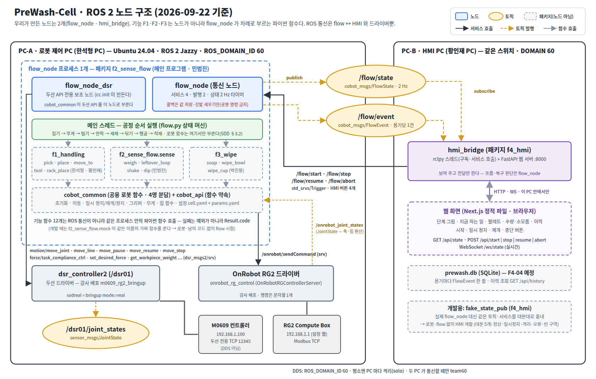

# ROS 2 노드 구조 — PreWash-Cell (D그룹 2조)

> 기준: 2026-09-22 · GitHub `main` · 원문 `docs/03_설계_SDD.md` §1·§3.2 · 결정 기록 `docs/meetings/`
> 주제: 경기장 다회용기 예비세척·식기세척기 팔레트 적재 자동화 셀 — 두산 M0609 1대 + OnRobot RG2

## 1. 한눈에 보기

- 우리가 만든 **ROS 2 노드는 2개**: `flow_node`(로봇 쪽 메인 프로그램) · `hmi_bridge`(모니터 화면 쪽).
- 기능 F1(집기·이송·적재) · F2(무게·털기·헹굼) · F3(닦기)는 **노드가 아니라 파이썬 함수**다. `flow_node` 의 메인 스레드가 순서대로 부른다.
- ROS 통신은 **flow ↔ HMI**(토픽 2 · 서비스 4)와 **드라이버**(두산 로봇 · 그리퍼)뿐이다.



그림 읽는 법: **사각형 = 노드 · 노란 타원 = 토픽 · 점선 상자 = 파이썬 패키지(노드 아님)**. 검은 실선 = 서비스 호출(요청 방향), 주황 점선 = 토픽 발행, 회색 = 파이썬 함수 호출.

## 2. PC 배치 — 시연은 2대

| PC | 누구 PC | 실행하는 것 | 네트워크 |
|---|---|---|---|
| **PC-A 로봇 제어** | 한석형 | 두산 드라이버(`dsr_controller2`) + 그리퍼 드라이버 + **`flow_node` 프로세스 1개** | 로봇 컨트롤러와 유선(192.168.1.x) · DDS `ROS_DOMAIN_ID=60` |
| **PC-B HMI** | 황인재 | **`hmi_bridge`**(FastAPI 웹 서버 :8000) + 브라우저 화면 | PC-A 와 같은 스위치 · DDS 60 |

- 로봇에 명령을 내는 곳은 **PC-A 의 프로세스 하나**뿐이다 — 명령이 겹치지 않는다.
- 평소 개발 때는 PC 마다 격리(`ROS_AUTOMATIC_DISCOVERY_RANGE=LOCALHOST`)해서 남의 로봇에 명령이 가지 않게 하고, **두 PC 가 통신할 때만**(통합 시험·시연) 두 PC 모두 `team60` 으로 연다.

## 3. 노드 목록

| 노드 | 패키지 | PC | 하는 일 | 주고받는 것 |
|---|---|---|---|---|
| **`flow_node`** | `f2_sense_flow` (우리) | A | 공정 순서를 실행하는 메인 프로그램. 통신 노드가 HMI 버튼을 받고 상태를 보낸다 | 서비스 제공 `/flow/start·stop·resume·abort` · 발행 `/flow/state`(2 Hz) · `/flow/event` |
| **`flow_node_dsr`** | `cobot_common` (우리) | A | 두산 API 전용 보조 노드. `cobot_common.init()` 이 자동으로 만든다 | 서비스·토픽 제공 없음 — 드라이버에 요청만 |
| **`hmi_bridge`** | `f4_hmi` (우리) | B | 상태를 받아 웹 화면에 넘기고, 화면 버튼을 flow 서비스로 넘긴다. **판단은 하지 않는다** | 구독 `/flow/state`·`/flow/event` · 서비스 호출 `/flow/*` · 웹 REST/WebSocket |
| `dsr_controller2` (`/dsr01`) | 두산 배포 `m0609_rg2_bringup` | A | 로봇 컨트롤러와 두산 전용 TCP(12345)로 통신 | 이동·힘제어·무게 서비스 제공 · `/dsr01/joint_states` 발행 |
| OnRobot RG2 드라이버 | 강사 배포 `onrobot_rg_control` | A | 그리퍼 명령·상태 | 서비스 `/onrobot/sendCommand` · 발행 `/onrobot_joint_states` |
| (개발용) `fake_state_pub` | `f4_hmi` (우리) | B | 실제 flow 대신 같은 토픽·서비스를 대본대로 흉내 — 로봇 없이 HMI 개발 | `flow_node` 와 같음 |

`ros2 node list` 로 보면 우리 노드는 `flow_node` · `flow_node_dsr` · `hmi_bridge` 셋이다.

## 4. 패키지 8개

| 패키지 | 종류 | 담당 | PC |
|---|---|---|---|
| `f2_sense_flow` | **노드 `flow_node`**(메인 프로그램) + 함수 모듈 `sense.py`(무게·털기·헹굼) + 시험용 가짜 모듈 `mock/` | 민범진 | A |
| `f1_handling` | 함수 모듈 `handling.py` — 집기·놓기·이동·툴·적재 (노드 아님) | 한석형 (툴 함수 `tool` 은 황인재) | A |
| `f3_wipe` | 함수 모듈 `wipe.py` — 세제 담금·그릇 닦기·컵 닦기 (노드 아님) | 박진용 | A |
| `cobot_common` | 라이브러리 — 두산 API 를 감싼 **공용 로봇 함수** + 설정 파일 2개(`cell.yaml` · `params.yaml`) | 4명 분담: 초기화·설정·이동 황인재 · 그리퍼·무게 민범진 · 힘 함수·패키지 정리 박진용 | A |
| `cobot_api` | 라이브러리 — **기능 함수의 약속**(ID·결과 코드·반환 타입·함수 서명). 로봇 코드 없음 | 황인재(PM) | A·B |
| `cobot_msgs` | 메시지 2개 `FlowState` · `FlowEvent` | 황인재(PM) | A·B |
| `f4_hmi` | **노드 `hmi_bridge`** + 개발용 `fake_state_pub` + 웹 화면(Next.js) | 황인재 | B |
| `prewash_bringup` | 런치 2개 — `prewash.launch.py`(실기) · `prewash_mock.launch.py`(로봇 없이) | 황인재(PM) | A |

## 5. `flow_node` 프로세스 안 — 스레드 3개

```
flow_node 프로세스 (PC-A)
├─ 메인 스레드      : 공정 순서 실행 → f1.pick() → f2.leftover_loop() → … (로봇 함수는 여기서만)
├─ 통신 노드 스레드 : /flow/start·stop·resume·abort 서비스 · /flow/state 2 Hz 타이머 · 그리퍼 상태 구독
│                     (콜백은 값 저장·깃발 세우기만 — 로봇 함수를 부르지 않는다)
└─ DSR 전용 노드    : 두산 API 가 필요할 때만 잠깐 쓴다(우리는 건드리지 않는다)
```

| 규칙 | 이유 |
|---|---|
| 로봇 함수는 **메인 스레드에서만** 부른다 | 두산 API(`DSR_ROBOT2`)는 "혼자 위에서 아래로 도는 스크립트"를 전제로 만들어져, 명령마다 자기가 실행기를 돌려 응답을 기다린다. 콜백·다른 스레드에서 부르면 교착한다(9/18 실험 TS-01) |
| 통신 콜백은 깃발만 세운다 | 버튼(일시 정지 등)을 누르면 콜백이 깃발만 세우고, 메인 스레드의 이동 함수가 0.05 s 마다 깃발을 보고 로봇에 멈춤·재개를 보낸다 |
| `cobot_common.init()` 을 프로그램 맨 앞에서 한 번 · 끝낼 때 `shutdown()` | 두산 API 는 import 되는 순간 노드를 고정한다. Ctrl+C 로 끄면 `shutdown()` 이 **로봇 정지 명령**을 보내고 끝낸다 |
| 기능 패키지는 두산 API 를 직접 부르지 않는다 — `cobot_common` 만 쓴다 | 초기화 순서·반환값 함정을 한 곳에서만 다룬다 |
| 실패는 예외가 아니라 `Result.code` | 프로세스가 하나라 함수 하나의 예외가 셀 전체를 멈춘다. 새어 나온 예외는 flow 가 `ROBOT_ERROR` 로 바꾼다 |

## 6. 왜 노드를 2개로 했나

처음(9/18 오전)에는 기능마다 노드 5개·서비스 12개였다. 9/18 저녁 실험(TS-01)에서 **서비스 콜백 안에서 두산 API 를 부르면 교착**하는 것을 확인하고, 두산 API 가 전제하는 "스크립트형"으로 바꿨다(결정 DSN-02b):

- 서비스 12개 → **같은 이름·인자·반환의 파이썬 함수 12개**(약속은 `cobot_api` 한 파일).
- 기능 사이에 ROS 통신이 없어서 **4명이 동시에** 자기 함수만 단독 시험할 수 있다(`rig_f1.py` · `rig_f2.py` · `rig_f3.py`).
- 로봇 명령은 한 프로세스의 한 스레드에서만 나간다 — 명령이 겹칠 수 없다.

## 7. 실행

```bash
# PC-A (로봇 제어) — 터미널 1: 두산 드라이버
sod && sodreal
# PC-A — 터미널 2: 셀 프로그램 (첫 실기는 속도 30 %)
ros2 launch prewash_bringup prewash.launch.py vel_scale:=0.3
# PC-B (HMI) → 브라우저 http://localhost:8000
ros2 run f4_hmi hmi_bridge
# 로봇 없이: 가짜 기능 함수로 flow + HMI
ros2 launch prewash_bringup prewash_mock.launch.py
```

## 8. 실기로 확인한 것 (9/22 기준)

| 확인 | 결과 | 기록 |
|---|---|---|
| 실행 뼈대 — flow_node 가 세 모듈 함수를 번갈아 부르며 상태 2 Hz · 정지 수락 | 통과(Virtual · 9/20) | V-20 |
| 좌표 재현 오차 | 0.24 mm 이내 | V-22 (`docs/test_logs/20260921_V-22_V-19_좌표재현_황인재.md`) |
| 이동 도중 Ctrl+C → 로봇 즉시 정지(정지 명령 0.5 s) | 5/5 | V-26 (`docs/test_logs/20260922_V-26_CtrlC정지_실기_황인재.md`) |
| 이동 도중 일시 정지 → 재개(HMI 일시 정지 버튼) | 관절 이동 2/2 · 직선·강제정지는 진행 중 | V-24 |
| HMI 버튼 → flow 서비스 응답 | 1 s 이내(가짜 flow) | F4-02 · V-13 |
